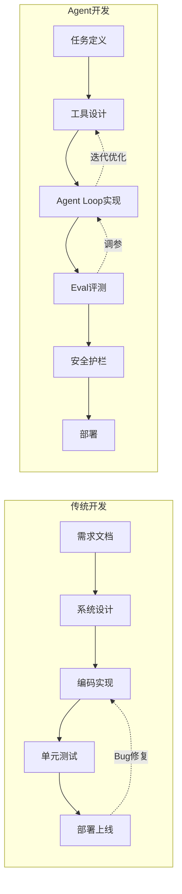
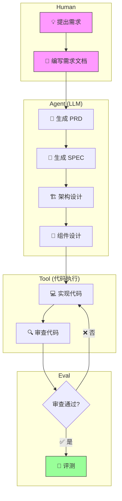

# 第一章：理解 Agent 开发 Workflow

> **在写一行 Agent 代码之前，先理解完整的 Agent 开发生命周期。**

对于一个前端开发者来说，从"写页面"到"写 Agent"最大的认知跃迁不是技术栈——TypeScript 还是那个 TypeScript——而是**思维方式**的转变。传统开发中，代码的行为是确定的：你写 `if (x > 0)`，x 大于 0 就一定进那个分支。但在 Agent 开发中，你写的不是"指令"，而是"编排"——你设计一个系统，让 LLM 在这个系统里自主决策。

这一章就是要帮你完成这个认知跃迁。

---

## 🎯 学习目标

学完本章后，你应该能回答以下问题：

| 问题 | 一句话答案 |
|------|-----------|
| Agent 开发有哪些阶段？ | 需求分析 → PRD → SPEC → 架构设计 → 实现 → 评测 → 部署，外加反馈闭环 |
| 每阶段的输入和输出是什么？ | 前一阶段的输出就是后一阶段的输入，形成严格的 I/O 契约 |
| Workflow 为什么对 Agent 很重要？ | Workflow 是 Agent 的骨架——没有它，Agent 就是一盘散沙 |
| Agent 设计模式有哪些？ | Tool-use Only、ReAct、Reflection、Multi-agent，四者复杂度递增 |

---

## 📖 核心概念

### 1.1 Agent 开发 vs 传统软件开发

表面上，两者都有"需求→设计→实现→测试→部署"的阶段。但底层逻辑完全不同。



**核心区别**：

| 维度 | 传统开发 | Agent 开发 |
|------|---------|-----------|
| **核心复杂度** | 业务逻辑本身的复杂度 | 模型行为 + 工具调用的编排复杂度 |
| **可预测性** | 高——代码怎么写，行为就怎么执行 | 低——同一个 prompt，两次输出可能不同 |
| **调试方式** | 断点 + 日志，可复现 | 追溯 trajectory（完整调用链），但不可完全复现 |
| **测试方法** | 单元测试 + 集成测试，确定性断言 | Eval case + 消融实验，统计性评估 |
| **上线风险** | 功能 bug，可修复 | 模型幻觉 + 工具误调用，可能导致"看似合理但错误"的结果 |
| **维护成本** | 业务变化 → 改代码 | 模型升级 → 重新评测、调整 prompt 和参数 |

> **一个类比**：传统开发像造钟表——每个齿轮精确咬合，运行结果可预测。Agent 开发像训练警犬——你只能设计训练路线和奖励机制，但无法控制它在具体场景中的每一个反应。

---

### 1.2 Agent 生命周期

完整的 Agent 开发生命周期包含 **6 个主阶段 + 1 个反馈闭环**：

```
┌────────────────────────────────────────────────────────────────────┐
│                   Agent 开发完整生命周期                              │
├────────────────────────────────────────────────────────────────────┤
│                                                                    │
│  PRD ──→ SPEC ──→ 架构设计 ──→ 实现 ──→ 评测 ──→ 部署             │
│   ↑                      ↓                 ↓                       │
│   └───────────────── 反馈闭环（复盘迭代）──────────────────┘         │
│                                                                    │
├────────────────────────────────────────────────────────────────────┤
│                                                                    │
│  阶段①  PRD（产品需求文档）                                        │
│    输入：散乱的想法、用户需求                                       │
│    输出：结构化的产品需求文档（用户故事 + 功能清单 + 验收标准）       │
│    问题："我们要做什么？给谁用？怎么才算做好？"                      │
│                                                                    │
│  阶段②  SPEC（技术规格说明）                                       │
│    输入：PRD 文档                                                  │
│    输出：技术规格文档（数据模型 + API 契约 + 状态管理策略）           │
│    问题："系统需要哪些数据？外部依赖是什么？模块怎么通信？"           │
│                                                                    │
│  阶段③  架构设计                                                   │
│    输入：SPEC 文档                                                 │
│    输出：架构蓝图（模块划分 + 依赖拓扑 + 文件层级 + 实施顺序）        │
│    问题："代码文件怎么组织？哪些可以复用？先做什么后做什么？"         │
│                                                                    │
│  阶段④  实现                                                       │
│    输入：架构蓝图 + 组件设计                                        │
│    输出：可运行代码                                                │
│    问题："代码怎么写？类型定义够严谨吗？边界情况处理了吗？"           │
│                                                                    │
│  阶段⑤  评测                                                       │
│    输入：可运行代码 + Eval case 集合                               │
│    输出：评测报告（通过率 + 消融实验数据 + 失败模式分析）             │
│    问题："Agent 在各种场景下表现如何？哪个模块拖了后腿？"             │
│                                                                    │
│  阶段⑥  部署                                                       │
│    输入：通过评测的代码 + 安全护栏配置                              │
│    输出：生产环境运行的服务                                        │
│    问题："监控怎么配？熔断阈值设多少？日志怎么追溯？"                │
│                                                                    │
│  🔄 反馈闭环（贯穿始终）                                            │
│    评测结果 → 回到架构/实现阶段改进                                 │
│    线上的 bad case → 补充 Eval case → 修复 → 重新评测               │
│                                                                    │
└────────────────────────────────────────────────────────────────────┘
```

#### 每个阶段详细解读

**PRD（产品需求文档）**：这是所有阶段的起点。你需要明确：目标用户是谁？核心解决的问题是什么？成功的标准是什么？在 Agent 语境下，PRD 还要特别注明**安全边界**——哪些行为是 Agent **绝对不能做**的。

**SPEC（技术规格说明）**：把"做什么"翻译成"怎么做"的技术语言。这里最关键的是**数据模型定义**和**API 契约**。例如，你的 Agent 需要调用哪些外部 API？每个 API 的入参和出参是什么？LLM 返回的 message 结构怎么定义？

**架构设计**：决定代码的骨架。模块怎么划分（Agent Loop / Tool Registry / Context Builder / Memory 等）？依赖关系是什么？文件目录怎么组织？这一阶段的产出直接影响后续开发效率。

**实现**：把设计变成代码。注意 Agent 开发中"实现"的特殊性——你写的代码不仅包含业务逻辑，还包含**对 LLM 行为的引导**（prompt engineering）和**工具调用的编排**。

**评测**：这是 Agent 开发**最不同于传统开发的阶段**。你不能只靠单元测试就放心上线。你需要 Eval case（覆盖正常场景 + 边界场景 + 恶意输入），需要消融实验（去掉某个模块看性能变化），需要 trajectory 分析（每一步 LLM 在想什么、调用了什么工具）。

**部署**：不仅仅是把代码跑起来。Agent 部署需要额外配置：熔断阈值、限流策略、成本上限、日志审计、权限分级。

> **💡 关键洞察**：这 6 个阶段不是死板的瀑布模型。实践中，评测阶段经常会触发你回到实现阶段甚至架构设计阶段做优化。反馈闭环不是"可选"的——它是确保 Agent 质量的核心机制。

---

### 1.3 输入/输出契约

每个阶段的输入和输出之间有严格的契约关系。前一阶段的输出就是后一阶段的输入。这种契约思维是 Agent 工程化的基础。

```mermaid
flowchart LR
    I0[💡 散乱想法] -->|"输入"| P1[阶段1<br/>需求分析]
    P1 -->|"输出"| O1[📄 结构化需求文档]
    O1 -->|"输入"| P2[阶段2<br/>PRD生成]
    P2 -->|"输出"| O2[📄 PRD文档]
    O2 -->|"输入"| P3[阶段3<br/>SPEC生成]
    P3 -->|"输出"| O3[📄 技术规格文档]
    O3 -->|"输入"| P4[阶段4<br/>架构设计]
    P4 -->|"输出"| O4[📐 架构蓝图]
    O4 -->|"输入"| P5[阶段5<br/>组件设计]
    P5 -->|"输出"| O5[📐 设计文档]
    O5 -->|"输入"| P6[阶段6<br/>代码实现]
    P6 -->|"输出"| O6[💻 可运行代码]
    O6 -->|"输入"| P7[阶段7<br/>代码审查]
    P7 -->|"判定"| D{通过?}
    D -->|✅ 是| P8[阶段8<br/>评测]
    D -->|❌ 否| P6
    P8 -->|"输出"| O7[📊 评测报告]
    
    style I0 fill:#f9f,stroke:#333,stroke-width:1px
    style O7 fill:#9f9,stroke:#333,stroke-width:2px
```



#### I/O 契约速查表

| 阶段 | 输入（前一阶段的输出） | 输出（后一阶段的输入） | 核心问题 |
|------|---------------------|---------------------|---------|
| **需求分析** | 散乱的想法、用户诉求 | 结构化需求文档 | 我们要解决什么问题？ |
| **PRD 生成** | 结构化需求文档 | PRD 文档（用户故事 + 功能清单 + 验收标准） | 怎么做才算做好？ |
| **SPEC 生成** | PRD 文档 | 技术规格文档（数据模型 + API 契约） | 系统需要什么数据和接口？ |
| **架构设计** | 技术规格文档 | 架构蓝图（模块划分 + 依赖图 + 文件层级） | 代码怎么组织？ |
| **组件设计** | 架构蓝图 | 组件设计文档（组件树 + Props + 状态方案） | UI/逻辑模块怎么拆分？ |
| **代码实现** | 组件设计文档 | 可运行代码 | 代码写得对吗？ |
| **代码审查** | 可运行代码 | 审查报告 / 通过判定 | 代码质量达标吗？ |
| **评测** | 通过审查的代码 + Eval cases | 评测报告（通过率 + 消融实验） | Agent 表现足够好吗？ |

> **💡 关键洞察**：I/O 契约的存在让**每个阶段可以独立进行**。你可以同时让一个人写 PRD、另一个人看架构、第三个人准备 Eval case——只要他们遵循共同的 I/O 格式。

以下是一个 TypeScript 类型定义，展示了这些 I/O 契约如何映射到代码：

```typescript
// === 每个阶段的 I/O 类型定义 ===

/** PRD 阶段输出 */
interface PRDDocument {
  title: string;
  userStories: UserStory[];
  featureList: Feature[];
  acceptanceCriteria: string[];
  securityBoundaries: string[];    // Agent 绝对不能做的事
}

/** SPEC 阶段输出 */
interface SPECDocument {
  dataModels: DataModelDef[];
  apiContracts: APIContract[];
  stateManagement: StateStrategy;
  externalDependencies: DependencyDef[];
}

/** 架构设计阶段输出 */
interface ArchitectureBlueprint {
  modules: ModuleDef[];           // 模块定义
  dependencyGraph: Dependency[];  // 模块间依赖
  fileTree: string[];            // 文件路径列表
  implementationOrder: string[];  // 建议实现顺序
}

/** 评测阶段输出 */
interface EvalReport {
  passRate: number;              // 通过率（0-1）
  totalCases: number;
  passedCases: number;
  failureAnalysis: FailureMode[];
  ablationResults: AblationResult[];
  recommendation: 'pass' | 'needs_fix' | 'fail';
}
```

---

### 1.4 为什么 Workflow 对 Agent 重要

你可能会问：**"LLM 那么智能，让它自己决定下一步不就行了吗？为什么还要硬性定义 Workflow？"**

答案是：**没有 Workflow 的 Agent 就像没有剧本的即兴表演**——偶尔会惊艳全场，但大部分时候是灾难。

Agent 的 Workflow 分为三个层次：

#### ① 隐式 Workflow（Implicit）

Agent 没有预设的步骤，每一步都由 LLM 动态决定做什么。

```typescript
// 隐式 Workflow 的思维模式——"走一步看一步"
// 用户输入："帮我调研一下 TypeScript 5.0 的新特性，然后写一份总结报告"

// 模型可能的内部推理（完全由模型自主决定）：
// Step 1: Thought: "我需要先搜索 TypeScript 5.0 的新特性列表"
//         Action: search("TypeScript 5.0 new features")
// Step 2: Thought: "让我看看装饰器的具体变化"
//         Action: search("TypeScript 5.0 decorators")
// Step 3: Thought: "找到足够信息了，开始写报告"
//         Action: write_file("typescript-5-report.md", ...)

// ✅ 优势：灵活，能处理意外情况
// ❌ 风险：可能偏离目标或陷入死循环
const implicitWorkflow = {
  type: 'implicit' as const,
  description: '经典 ReAct：没有预设步骤',
  example: 'LangChain AgentExecutor',
  risk: '不可控——LLM 可能跑偏或开销失控',
};
```

**适用场景**：开放式探索任务、复杂度不确定的调研。

#### ② 显式 Workflow（Explicit / DAG）

开发者在代码中硬性定义每一步，Agent 严格按 DAG 执行。

```typescript
// 显式 Workflow——"流水线式执行"
interface WorkflowStep<TInput, TOutput> {
  name: string;
  execute: (input: TInput) => Promise<TOutput>;
}

// 定义一个固定的三步流水线
class SearchSummarizePipeline {
  async run(query: string) {
    // 第 1 步：搜索（固定）
    const rawResults = await this.search(query);
    
    // 第 2 步：过滤（固定）  
    const filtered = await this.filter(rawResults);
    
    // 第 3 步：总结（固定）
    const summary = await this.summarize(filtered);
    
    return summary;
  }
}

// ✅ 优势：可控、可预测、开销固定
// ❌ 短板：死板，无法处理预期之外的场景
const explicitWorkflow = {
  type: 'explicit' as const,
  description: 'DAG：步骤由开发者定义',
  example: '固定流水线',
  risk: '不够灵活——无法适应新场景',
};
```

**适用场景**：确定性高的任务（搜索→过滤→总结、数据 ETL）。

#### ③ 混合 Workflow（Hybrid）

**框架约束骨架，模型填充细节**——这是本书项目采用的方式。

```typescript
// 混合 Workflow——"骨架 + 血肉"
// 骨架（开发者定义）：阶段顺序固定
// 血肉（LLM 填充）：每个阶段内的具体内容由 LLM 动态生成

type Phase =
  | 'requirement_analysis'
  | 'prd_generation'
  | 'spec_generation'
  | 'architecture_design'
  | 'component_design'
  | 'code_implementation'
  | 'code_review'
  | 'evaluation';

// 骨架固定，但每个阶段内部的执行策略由 LLM 决定
interface HybridWorkflowConfig {
  phases: Phase[];          // 阶段顺序固定（骨架）
  maxStepsPerPhase: number; // 每个阶段最多走几步（护栏）
  allowPhaseSkip: boolean;  // 是否允许跳过某阶段（灵活性）
}

// ✅ 优势：既有结构保证质量，又有灵活性应对变化
// ❌ 挑战：设计难度最高——骨架太粗会失控，太细会僵化
const hybridWorkflow = {
  type: 'hybrid' as const,
  description: '框架约束骨架，模型填充细节',
  example: '本书项目（Phase 2-6 逐步演变）',
  risk: '设计难度高——需要精心平衡控制与自由',
};
```

**适用场景**：复杂的、需要质量保障的 Agent 系统。

#### 三种 Workflow 对比

| 维度 | 隐式 (Implicit) | 显式 (Explicit) | 混合 (Hybrid) |
|------|:--------------:|:--------------:|:------------:|
| **控制力** | 低 | 高 | 中高 |
| **灵活性** | 高 | 低 | 中 |
| **可预测性** | 低 | 高 | 中高 |
| **适用场景** | 开放探索 | 固定流水线 | 复杂工程任务 |
| **实现难度** | 低 | 低 | 中高 |
| **典型代表** | ReAct | 传统 Pipeline | LangGraph / 本书项目 |

> **💡 关键洞察**：这三种 Workflow 不是互斥的。一个成熟的 Agent 系统通常在不同层级混合使用——宏观上采用混合 Workflow（骨架固定），微观上某些子任务采用隐式 Workflow（LLM 自主探索），另一些关键路径采用显式 Workflow（硬编码保障正确性）。

---

### 1.5 Agent 设计模式全景

在理解了 Workflow 类型之后，我们再来看 Agent 的**设计模式**——即 Agent 内部是如何"思考"和"行动"的。

```mermaid
graph TB
    subgraph "A: Tool-use Only（工具调用）"
        A1[🗣️ 用户输入] --> A2[🧠 LLM]
        A2 --> A3[🔧 工具选择]
        A3 --> A4[⚙️ 工具执行]
        A4 --> A5[📨 返回结果]
        A5 --> A6[💬 输出回答]
    end
    
    subgraph "B: ReAct（推理 + 行动循环）"
        B1[🗣️ 用户输入] --> B2[🤔 LLM 推理<br/>Thought]
        B2 --> B3[🎯 决定行动<br/>Action]
        B3 --> B4[⚙️ 执行工具<br/>Observe]
        B4 --> B5{任务完成?}
        B5 -->|未完成| B2
        B5 -->|已完成| B6[📤 最终输出]
    end
    
    subgraph "C: Reflection（自我反思）"
        C1[✍️ 生成初版输出] --> C2[🔍 自我评价<br/>Critique]
        C2 -->|❌ 不满意| C1
        C2 -->|✅ 满意| C3[📤 最终输出]
    end
    
    subgraph "D: Multi-agent（多 Agent 协作）"
        D0[🗣️ 用户输入] --> D1[🎭 Orchestrator<br/>编排器]
        D1 --> D2[🔬 Researcher<br/>研究员]
        D1 --> D3[✍️ Writer<br/>写手]
        D1 --> D4[👁️ Reviewer<br/>审查员]
        D2 --> D5[📊 汇总整合]
        D3 --> D5
        D4 --> D5
        D5 --> D6[📤 最终输出]
    end
```



#### 四种模式详解

| 模式 | 一句话概括 | 适合场景 | 复杂度 | 轮次 |
|------|-----------|---------|:-----:|:----:|
| **Tool-use Only** | 用户问一句，模型调一次工具，完事 | 单轮知识问答、天气查询、翻译 | ⭐ 低 | 1 |
| **ReAct** | 模型边思考边行动，反复循环直到完成 | 多步推理、代码生成调试、网页搜索 | ⭐⭐ 中 | N |
| **Reflection** | 模型写完自己检查，改到满意再输出 | 代码审查、文案润色、翻译优化 | ⭐⭐ 中 | 2-N |
| **Multi-agent** | 多个 Agent 各司其职，编排器统一调度 | 复杂报告生成、大型项目开发、客服系统 | ⭐⭐⭐ 高 | N + M |

#### 四种模式的代码骨架

```typescript
// === A: Tool-use Only 骨架 ===
async function toolUseOnly<T>(prompt: string, tool: Tool<T>): Promise<T> {
  const response = await llm.call(prompt, { tools: [tool] });
  if (response.toolCall) {
    return await tool.execute(response.toolCall.args);
  }
  return response.text as unknown as T;
}

// === B: ReAct 骨架 ===
async function reactLoop(goal: string, tools: Tool[], maxSteps = 10) {
  let steps = 0;
  const messages: Message[] = [{ role: 'user', content: goal }];
  
  while (steps < maxSteps) {
    const response = await llm.call(messages, { tools });
    messages.push(response);
    
    if (response.type === 'final_answer') {
      return response.content;
    }
    
    // 执行工具调用
    for (const toolCall of response.toolCalls) {
      const result = await executeTool(toolCall);
      messages.push({ role: 'tool', toolCallId: toolCall.id, content: result });
    }
    steps++;
  }
  throw new Error('Max steps reached without completion');
}

// === C: Reflection 骨架 ===
async function reflectionLoop<T>(generate: () => Promise<T>, critique: (output: T) => Promise<boolean>, maxRounds = 3) {
  let output = await generate();
  for (let i = 0; i < maxRounds; i++) {
    const isSatisfied = await critique(output);
    if (isSatisfied) return output;
    output = await generate(); // 重新生成
  }
  return output; // 最后一次的产出
}

// === D: Multi-agent 骨架（简化版）===
interface Agent { name: string; run: (task: string) => Promise<string>; }

async function multiAgentPipeline(orchestrator: Agent, workers: Agent[], task: string) {
  // Orchestrator 拆解任务
  const subtasks: string[] = await orchestrator.run(`Decompose this task into subtasks: ${task}`);
  
  // 并行执行子任务
  const results = await Promise.all(
    subtasks.map((subtask, i) => workers[i % workers.length].run(subtask))
  );
  
  // Orchestrator 汇总
  return orchestrator.run(`Synthesize these results: ${results.join('\n---\n')}`);
}
```

#### 本书项目的演化路径

本项目不是一开始就用最复杂的模式，而是**逐步演进**的：

```
Phase 2 ──→ 关键词匹配路由（连 LLM 都没有）
               ↓ 简单规则路由，不属于以上四种，是教学铺垫
               
Phase 3 ──→ Tool-use Only + Tool Calling 协议
               ↓ LLM 来了，但每次只调一个工具
               
Phase 5-6 ─→ ReAct 模式
               ↓ 有了 Eval 保障和可靠性护栏，Agent 可以自主循环
               
Phase 7 ──→ 升级到 LangChain.js AgentExecutor
               ↓ 框架级别的 ReAct 实现，外加 RAG 和 Memory
               
毕业时 ──→ 具备实现任意模式的能力
```

> **💡 关键洞察**：选择哪种模式不是"越复杂越好"，而是**匹配任务需求**。如果你的 Agent 只需要查个天气，用 Multi-agent 就是杀鸡用牛刀。反之，如果任务需要多步推理和工具组合，Tool-use Only 就不够用了。

---

## 🛠️ 动手练习

理论说完了，来动手吧。这三个练习会帮你把概念变成自己的东西。

### 练习 1：绘制你自己的 Agent 开发 Workflow 图

**任务**：打开你熟悉的一个项目（可以是你的个人项目、团队项目，或者本书项目），绘制它的 Workflow 图。

**要求**：
- 用 Mermaid 语法绘制（或者手画拍照）
- 标出每个阶段的**输入**和**输出**
- 用不同颜色标注：开发者负责的部分、LLM 负责的部分、自动化工具负责的部分

**提示**：画图时问自己三个问题——
1. 我的项目中"做什么"和"怎么做"是分开的吗？
2. 哪个阶段最容易出问题（最容易成为瓶颈）？
3. 如果去掉一个阶段，系统还能正常工作吗？

**示例**（本书项目的简化 Workflow）：



### 练习 2：思考"如果去掉某个阶段会发生什么？"

**任务**：选择下面一个场景（或自己想一个），分析去掉该阶段可能导致的后果。

**场景 A**：去掉 SPEC 阶段，直接从 PRD 进入架构设计。

<details>
<summary>💡 思考提示（点击展开）</summary>

- 没有 SPEC，架构师怎么知道需要哪些数据模型？
- API 契约在什么时候定义？
- 写到一半发现需要某个外部 API，但架构里没预留接口——怎么办？
</details>

**场景 B**：去掉评测阶段，代码审查通过后直接部署。

<details>
<summary>💡 思考提示（点击展开）</summary>

- Agent 在实际场景中会做什么"出人意料"的事？
- 用户输入恶意 prompt 时 Agent 会怎么反应？
- 如果模型升级了（比如从 GPT-4 换到 GPT-4.5），你怎么知道效果变好了还是变差了？
</details>

**场景 C**：去掉反馈闭环，每个阶段只走一次。

<details>
<summary>💡 思考提示（点击展开）</summary>

- Agent 开发中是"一次设计就完美"的情况多，还是"试错迭代"的情况多？
- 没有反馈闭环，开发周期是变短了还是变长了？
- 长期来看，没有反馈闭环的项目质量会怎么样？
</details>

### 练习 3：分析一个开源项目的 Workflow

**任务**：选择一个开源 Agent 项目，分析它采用了哪种设计模式。

**推荐项目**：
1. **[LangChain](https://github.com/langchain-ai/langchain)** — AgentExecutor 的设计模式
2. **[AutoGPT](https://github.com/Significant-Gravitas/AutoGPT)** — 自主 Agent 的 Workflow
3. **[Vercel AI SDK](https://github.com/vercel/ai)** — 前端友好的 Agent 模式

**分析框架**：

```typescript
// 用这个结构来分析你选择的项目
interface ProjectWorkflowAnalysis {
  projectName: string;
  
  // Workflow 类型
  workflowType: 'implicit' | 'explicit' | 'hybrid';
  
  // 设计模式
  designPattern: 'tool-use' | 'react' | 'reflection' | 'multi-agent';
  
  // 证据（引用代码或文档里的描述）
  evidence: string[];
  
  // 你的评价
  comments: {
    pros: string[];
    cons: string[];
    fitScore: number; // 1-10, 这种模式对项目的适合程度
  };
}
```

---

## 📊 自测清单

学完本章后，逐条检查自己是否掌握：

- [ ] 我能说出 Agent 开发与传统软件开发的 **5 个核心区别**（核心复杂度、可预测性、调试、测试、风险）
- [ ] 我能绘制出 Agent 开发的完整生命周期图（6 个主阶段 + 反馈闭环）
- [ ] 我能说出每个阶段的**输入和输出**是什么
- [ ] 我能解释**隐式 Workflow / 显式 Workflow / 混合 Workflow** 的区别，并举例说明
- [ ] 我能说出 **4 种 Agent 设计模式**（Tool-use Only / ReAct / Reflection / Multi-agent），并描述各自适合的场景
- [ ] 我知道本书项目**从 Phase 2 到 Phase 7 的设计模式演化路径**
- [ ] 我能回答"为什么 Workflow 对 Agent 很重要"（至少给出 2 个理由）
- [ ] 我能用 TypeScript 类型定义表达**至少一个阶段的 I/O 契约**

> 💡 如果某个问题不能立刻回答，回看对应章节的 **💡 关键洞察** 框——它们浓缩了每个小节的核心观点。

---

## 🔗 延伸阅读

1. **[Anthropic: Building effective agents](https://docs.anthropic.com/en/docs/build-with-claude/agentic)**
   Anthropic 官方关于 Agent 开发模式的深度文章，也是本书最核心的参考来源之一。文中对比了 Workflow 和 Agent 的区别，以及何时用哪种模式。

2. **[Vercel AI SDK: Workflows](https://sdk.vercel.ai/docs/ai-sdk-ui/workflow)**
   Vercel AI SDK 的 Workflow 概念文档。如果你有前端背景，从这里能看到"前端思维"和"Agent 思维"如何融合。

3. **[LangGraph: Stateful Workflows](https://langchain-ai.github.io/langgraph/)**
   LangChain 团队的状态化 Workflow 框架。LangGraph 是混合 Workflow 的一个工业级实现——用图结构定义 Agent 的骨架，用 LLM 填充细节。

4. **[Building Agents with OpenAI](https://platform.openai.com/docs/guides/agents)**
   OpenAI 官方关于 Agent 开发的指南，涵盖了 Function Calling 的最佳实践。

5. **[Awesome LLM Apps](https://github.com/Shubhamsaboo/awesome-llm-apps)**
   一个精选的 LLM 应用集合，包含各种设计模式的实际代码。适合在看完本章后去看看"别人是怎么做 Agent 的"。

---

> **下一章预告**：第二章，我们将在本章建立的 Workflow 认知基础上，**用 TypeScript 实现一个最简单的 Agent Loop**——输入→理解→行动→观察的完整循环，只靠关键词匹配（不依赖 LLM），让你真正理解 Agent 内部发生了什么。
