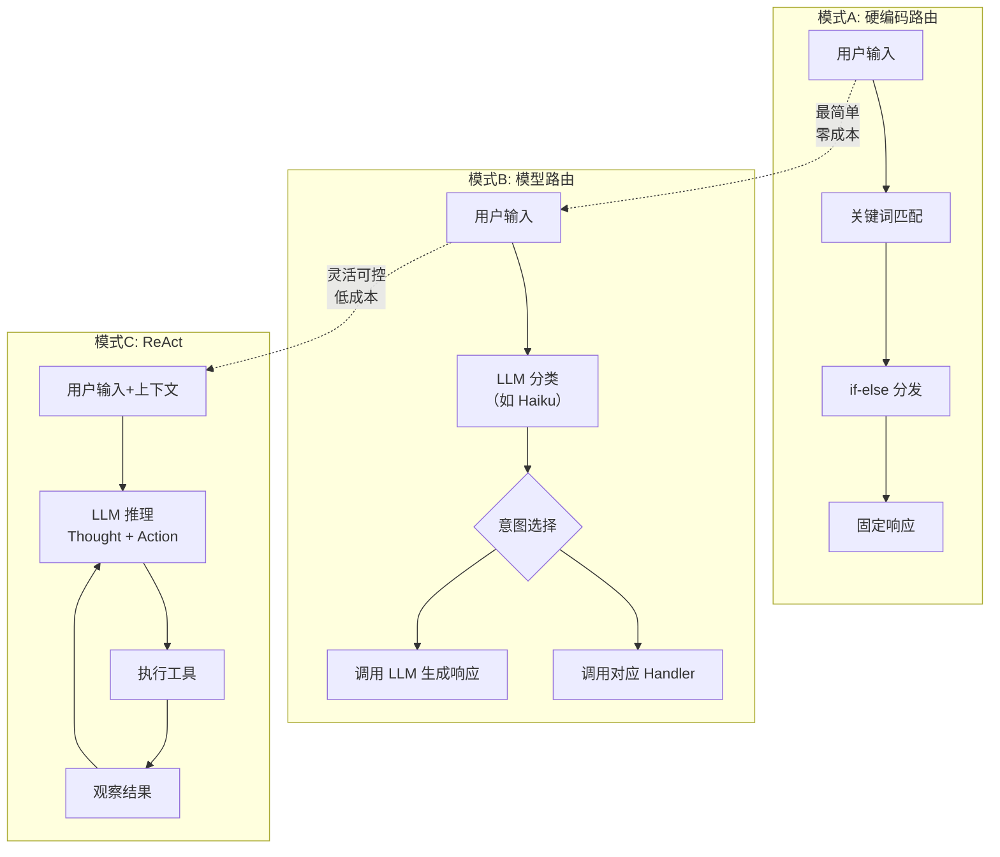

# 第二章：实现 Agent Loop（核心循环）

> **一句概括**：Agent 的大脑——输入 → 思考 → 行动 → 观察 的循环。理解 Agent Loop 是掌握 Agent 开发的基石，本章带你从零搭建一个完整可运行的最简循环。

---

## 🎯 学习目标

完成本章后，你将能够：

| 问题 | 答案 |
|------|------|
| Agent Loop 是什么？ | 模型/代码持续接收输入 → 决定调用什么工具 → 执行工具 → 观察结果 → 决定下一步的循环结构 |
| 最基本的 Agent Loop 怎么写？ | 一个 `while` 循环 + 意图分类 + 函数分发，约 80 行 TypeScript 代码 |
| 为什么需要 Loop 而不是一次调用？ | 工具调用的结果需要反馈给决策者，让它判断是否完成任务或需要更多操作 |
| ReAct 是什么？ | Reason + Act，模型边推理边行动的模式，是目前最主流的 Agent 循环范式 |
| Loop 的终止条件有哪些？ | 任务完成 → 超过最大步数 → 用户中断 → 成本超限 → 异常错误 |

---

## 📖 核心概念

### 2.1 Agent Loop 的解剖

任何一个 Agent Loop，无论底层用的是关键词匹配还是 GPT-4，都共享同一个核心结构。理解这个结构是写出健壮 Agent 的第一步。

```
┌──────────────────────────────────────────────────────────┐
│                     Agent Loop（核心循环）                  │
│                                                           │
│   ┌────────────┐                                          │
│   │   输入     │  ← 用户消息 / 系统触发 / 工具结果反馈    │
│   └─────┬──────┘                                          │
│         ↓                                                 │
│   ┌────────────┐                                          │
│   │   理解     │  ← 分类意图（LLM 推理或关键词匹配）      │
│   └─────┬──────┘                                          │
│         ↓                                                 │
│   ┌────────────┐    ┌──────────────────┐                  │
│   │   决策     │ →  │ 选用哪个工具/函数 │  ← Tool Select │
│   └─────┬──────┘    └──────────────────┘                  │
│         ↓                                                 │
│   ┌────────────┐                                          │
│   │   执行     │  ← 调用工具 / 执行处理函数，拿到结果     │
│   └─────┬──────┘                                          │
│         ↓                                                 │
│   ┌────────────┐                                          │
│   │   观察     │  ← 评估结果：是否满足需求？是否出错？    │
│   └─────┬──────┘                                          │
│         ↓                                                 │
│   ┌────────────┐                                          │
│   │   终止?    │  → Yes → 输出结果，退出循环              │
│   └─────┬──────┘                                          │
│         │ No                                              │
│         ↓                                                 │
│     回到"理解"步骤，循环继续                               │
│                                                           │
│   终止条件：                                               │
│   • 任务已完成（用户确认 / LLM 判定）                     │
│   • currentStep >= maxSteps（安全阀）                     │
│   • 用户输入退出命令                                      │
│   • 成本超过 costLimit                                    │
│   • 出现不可恢复的错误                                    │
└──────────────────────────────────────────────────────────┘
```

每个步骤的含义：

| 步骤 | 作用 | 技术实现方式 |
|------|------|-------------|
| **输入** | 接收外部信息，可能是用户打字、工具执行结果、系统事件 | `readline` / HTTP 请求 / 消息队列 |
| **理解** | 分析输入，判断用户意图或下一步该做什么 | 关键词匹配 / LLM 分类 / 向量检索 |
| **决策** | 决定调用哪个工具或执行哪个分支逻辑 | `if-else` 路由 / LLM Tool Calling / ReAct 推理 |
| **执行** | 调用实际的工具函数，拿到结构化结果 | 函数调用 / API 请求 / 沙箱执行 |
| **观察** | 评估执行结果，决定是继续循环还是终止 | 结果校验 / LLM 自我评估 / 异常捕获 |
| **终止?** | 判断是否满足退出条件 | 布尔条件检查 / LLM 判断是否完成任务 |

#### 理解 Loop 的关键洞察

Agent Loop 和传统的 `while` 循环有一个根本区别：**传统循环的终止条件是预先定义的（如 `i < 10`），而 Agent Loop 的终止条件是动态计算的**——它依赖

---

### 2.2 最简单的 Agent Loop 代码骨架

下面我们动手写一个完整的、可运行的 Agent Loop。这个版本使用**硬编码关键词匹配**（模式 A），不依赖任何 LLM API，确保你可以立即在本地跑起来。

> **运行环境**：Node.js ≥ 18，TypeScript 5.x，ESM 模块。

#### 第一步：状态定义

```typescript
// ── state.ts ──
// Agent 状态管理

import { readFile, writeFile, unlink, access } from "node:fs/promises";
import { constants } from "node:fs";

export interface AgentStateData {
  phase: string;
  userInput: string;
  history: Array<[string, string]>;
  toolResults: Record<string, unknown>;
  maxSteps: number;
  currentStep: number;
}

export class AgentState implements AgentStateData {
  phase: string;
  userInput: string;
  history: Array<[string, string]>;
  toolResults: Record<string, unknown>;
  maxSteps: number;
  currentStep: number;

  constructor(data?: Partial<AgentStateData>) {
    this.phase = data?.phase ?? "需求分析";
    this.userInput = data?.userInput ?? "";
    this.history = data?.history ?? [];
    this.toolResults = data?.toolResults ?? {};
    this.maxSteps = data?.maxSteps ?? 10;
    this.currentStep = data?.currentStep ?? 0;
  }

  toJSON(): Record<string, unknown> {
    return {
      phase: this.phase,
      history: this.history.slice(-20),
      maxSteps: this.maxSteps,
      currentStep: this.currentStep,
    };
  }

  static fromJSON(data: Record<string, unknown>): AgentState {
    return new AgentState({
      phase: (data.phase as string) ?? "需求分析",
      history: (data.history as Array<[string, string]>) ?? [],
      maxSteps: (data.maxSteps as number) ?? 10,
      currentStep: (data.currentStep as number) ?? 0,
    });
  }
}

export class StateStore {
  path: string;

  constructor(path = "agent_state.json") {
    this.path = path;
  }

  async save(state: AgentState): Promise<void> {
    const json = JSON.stringify(state.toJSON(), null, 2);
    await writeFile(this.path, json, "utf-8");
  }

  async load(): Promise<AgentState | null> {
    try {
      await access(this.path, constants.F_OK);
    } catch {
      return null;
    }
    const raw = await readFile(this.path, "utf-8");
    const data = JSON.parse(raw) as Record<string, unknown>;
    return AgentState.fromJSON(data);
  }

  async clear(): Promise<void> {
    try {
      await unlink(this.path);
    } catch {
      // File doesn't exist; nothing to clear
    }
  }
}
```

#### 第二步：意图分类器

```typescript
// ── intent_classifier.ts ──
// 意图分类器 — 关键词匹配

const INTENTS: Map<string, string> = new Map([
  ["query_phase", "查询当前阶段"],
  ["next_step", "询问下一步做什么"],
  ["execute_phase", "执行当前阶段的操作"],
  ["help", "显示帮助信息"],
  ["exit", "退出程序"],
  ["unknown", "无法理解的输入"],
]);

export function classifyIntent(userInput: string): string {
  const text = userInput.trim().toLowerCase();

  if (["退出", "结束", "exit", "quit", "bye"].some((kw) => text.includes(kw))) {
    return "exit";
  }
  if (["帮助", "help", "怎么用", "命令", "支持"].some((kw) => text.includes(kw))) {
    return "help";
  }
  if (["在哪", "阶段", "到哪里", "进度", "状态"].some((kw) => text.includes(kw))) {
    return "query_phase";
  }
  if (["下一步", "然后", "接下来", "后面", "继续"].some((kw) => text.includes(kw))) {
    return "next_step";
  }
  if (["开始", "帮我", "执行", "做", "生成", "写"].some((kw) => text.includes(kw))) {
    return "execute_phase";
  }

  return "unknown";
}

export function getIntentDescription(): string {
  const lines: string[] = ["📋 可用命令："];
  for (const [intent, desc] of INTENTS) {
    lines.push(`  · 说 '${desc}' → 触发 ${intent}`);
  }
  return lines.join("\n");
}
```

#### 第三步：处理函数（内联在 agent_loop.ts 中）

处理函数直接定义在 `agent_loop.ts` 中，无需单独的文件。

```typescript
// （以下代码均位于 agent_loop.ts 中）

// Workflow 阶段映射表：当前阶段 → 下一阶段
const WORKFLOW_MAP: Record<string, string> = {
  "需求分析": "PRD 生成",
  "PRD 生成": "技术规格",
  "技术规格": "架构设计",
  "架构设计": "组件设计",
  "组件设计": "代码实现",
  "代码实现": "代码审查",
  "代码审查": "评测",
};

// 各阶段的描述信息
const PHASE_DESCRIPTIONS: Record<string, string> = {
  "需求分析": "澄清用户需求，定义问题边界",
  "PRD 生成": "编写产品需求文档，定义功能清单",
  "技术规格": "编写技术规格文档，定义 API 和数据模型",
  "架构设计": "设计系统架构，划分模块边界",
  "组件设计": "设计 React 组件树和状态方案",
  "代码实现": "编写实际代码",
  "代码审查": "审查代码质量",
};

/** 查询当前阶段 */
function handleQueryPhase(state: AgentState): string {
  const desc = PHASE_DESCRIPTIONS[state.phase] ?? "";
  return `📌 当前阶段：**${state.phase}**\n   └─ ${desc}`;
}

/** 询问下一步做什么 */
function handleNextStep(state: AgentState): string {
  const nextPhase = WORKFLOW_MAP[state.phase];
  if (nextPhase) {
    const desc = PHASE_DESCRIPTIONS[nextPhase] ?? "";
    return (
      `➡️ 下一步：**${nextPhase}**\n` +
      `   └─ ${desc}\n\n` +
      `💡 当前阶段 '${state.phase}' 完成后，自动进入 ${nextPhase}`
    );
  }
  return "🚀 所有阶段已完成！项目交付。";
}

/** 执行当前阶段 */
function handleExecutePhase(state: AgentState): string {
  const phaseSkills: Record<string, string> = {
    "需求分析": "pi-requirement-analyzer",
    "PRD 生成": "pi-prd-generator",
    "技术规格": "pi-spec-generator",
    "架构设计": "pi-architecture-designer",
    "组件设计": "pi-component-designer",
    "代码实现": "pi-code-implementer",
    "代码审查": "pi-code-reviewer",
  };
  const skill = phaseSkills[state.phase];
  if (skill) {
    return (
      `🔧 开始执行：**${state.phase}**\n` +
      `   └─ 推荐使用技能：\`${skill}\`\n` +
      `\n完成后输入 '继续' 进入下一阶段。`
    );
  }
  return `⏳ 当前阶段 '${state.phase}' 需要人工完成。`;
}

/** 显示帮助信息 */
function handleHelp(state: AgentState): string {
  return (
    "🤖 **Agent 开发引导器**\n\n" +
    "我帮你管理 Agent 开发的 6 个阶段流程。\n\n" +
    `📌 当前阶段：${state.phase}\n\n` +
    `${getIntentDescription()}`
  );
}
```

#### 第四步：主循环

```typescript
// ── agent_loop.ts ──
// Agent 开发引导器 — Phase 2：关键词匹配版 Agent Loop

import { createInterface } from "node:readline/promises";
import { stdin as input, stdout as output } from "node:process";
import chalk from "chalk";
import { classifyIntent, getIntentDescription } from "./intent_classifier.js";
import { AgentState, StateStore } from "./state.js";

const WORKFLOW_MAP: Record<string, string> = {
  "需求分析": "PRD 生成",
  "PRD 生成": "技术规格",
  "技术规格": "架构设计",
  "架构设计": "组件设计",
  "组件设计": "代码实现",
  "代码实现": "代码审查",
  "代码审查": "评测",
};

const PHASE_DESCRIPTIONS: Record<string, string> = {
  "需求分析": "澄清用户需求，定义问题边界",
  "PRD 生成": "编写产品需求文档，定义功能清单",
  "技术规格": "编写技术规格文档，定义 API 和数据模型",
  "架构设计": "设计系统架构，划分模块边界",
  "组件设计": "设计 React 组件树和状态方案",
  "代码实现": "编写实际代码",
  "代码审查": "审查代码质量",
};

function handleQueryPhase(state: AgentState): string {
  const desc = PHASE_DESCRIPTIONS[state.phase] ?? "";
  return `📌 当前阶段：**${state.phase}**\n   └─ ${desc}`;
}

function handleNextStep(state: AgentState): string {
  const nextPhase = WORKFLOW_MAP[state.phase];
  if (nextPhase) {
    const desc = PHASE_DESCRIPTIONS[nextPhase] ?? "";
    return (
      `➡️ 下一步：**${nextPhase}**\n` +
      `   └─ ${desc}\n\n` +
      `💡 当前阶段 '${state.phase}' 完成后，自动进入 ${nextPhase}`
    );
  }
  return "🚀 所有阶段已完成！项目交付。";
}

function handleExecutePhase(state: AgentState): string {
  const phaseSkills: Record<string, string> = {
    "需求分析": "pi-requirement-analyzer",
    "PRD 生成": "pi-prd-generator",
    "技术规格": "pi-spec-generator",
    "架构设计": "pi-architecture-designer",
    "组件设计": "pi-component-designer",
    "代码实现": "pi-code-implementer",
    "代码审查": "pi-code-reviewer",
  };
  const skill = phaseSkills[state.phase];
  if (skill) {
    return (
      `🔧 开始执行：**${state.phase}**\n` +
      `   └─ 推荐使用技能：\`${skill}\`\n` +
      `\n完成后输入 '继续' 进入下一阶段。`
    );
  }
  return `⏳ 当前阶段 '${state.phase}' 需要人工完成。`;
}

function handleHelp(state: AgentState): string {
  return (
    "🤖 **Agent 开发引导器**\n\n" +
    "我帮你管理 Agent 开发的 6 个阶段流程。\n\n" +
    `📌 当前阶段：${state.phase}\n\n` +
    `${getIntentDescription()}`
  );
}

export async function runAgentLoop(): Promise<void> {
  const store = new StateStore();
  const rl = createInterface({ input, output });

  let state: AgentState;

  const savedState = await store.load();
  if (savedState) {
    state = savedState;
    console.log(chalk.yellow("🔄 检测到上次未完成的工作流"));
    console.log(chalk.blue(`📌 恢复阶段：${state.phase}`));
    console.log(chalk.gray(`📊 进度：第 ${state.currentStep} 步\n`));
  } else {
    state = new AgentState();
    console.log(chalk.green("🤖 **Agent 开发引导器** 已启动"));
    console.log(chalk.blue(`📌 起始阶段：${state.phase}`));
    console.log(chalk.gray("💡 输入 '帮助' 查看可用命令\n"));
  }

  while (state.currentStep < state.maxSteps) {
    const userInput = await rl.question(chalk.cyan("> "));
    const trimmed = userInput.trim();

    if (!trimmed) {
      continue;
    }

    state.userInput = trimmed;
    state.currentStep += 1;
    state.history.push(["user", trimmed]);

    const intent = classifyIntent(trimmed);
    let response: string;

    if (intent === "query_phase") {
      response = handleQueryPhase(state);
    } else if (intent === "next_step") {
      response = handleNextStep(state);
    } else if (intent === "execute_phase") {
      response = handleExecutePhase(state);
    } else if (intent === "help") {
      response = handleHelp(state);
    } else if (intent === "exit") {
      console.log(chalk.green("👋 再见！期待下次继续你的 Agent 开发之旅。"));
      await store.save(state);
      rl.close();
      return;
    } else {
      response =
        "🤔 我不太理解你的意思。\n\n" +
        "试试说：\n" +
        "  · '我在哪' → 查看当前阶段\n" +
        "  · '下一步' → 查看下一步\n" +
        "  · '帮我'    → 执行当前阶段\n" +
        "  · '帮助'    → 显示帮助";
    }

    console.log(response);
    state.history.push(["agent", response]);
    console.log();
    await store.save(state);
  }

  console.log(chalk.yellow(`\n⚠️ 已达到最大步数限制 (${state.maxSteps})`));
  await store.save(state);
  rl.close();
}

#### 完整项目文件结构

```
agentDev/
├── src/
│   ├── agent_loop.ts         # 主循环入口（含处理函数）
│   ├── state.ts              # 状态类 + StateStore 持久化
│   ├── intent_classifier.ts  # 意图分类器
│   └── tsconfig.json         # TypeScript 配置
└── package.json
```

#### 配置文件

```json
// ── package.json（项目根目录）──
{
  "name": "agent-dev-guide",
  "version": "1.0.0",
  "type": "module",
  "scripts": {
    "phase2": "npx tsx phases/phase-2-agent-loop/src/agent_loop.ts",
    "test": "npx vitest run"
  },
  "dependencies": {
    "chalk": "^5.3.0"
  },
  "devDependencies": {
    "tsx": "^4.16.0",
    "typescript": "^5.5.0",
    "vitest": "^2.0.0"
  }
}
```

> **运行命令**：`npm install && npm run phase2`

---

### 2.3 三种 Agent Loop 模式

上面我们实现的是模式 A（硬编码路由）。下面是三种模式的完整对比：



| 特性 | A. 硬编码路由 | B. 模型路由 | C. ReAct |
|------|:---:|:---:|:---:|
| **延迟** | ⚡ 毫秒级 | 🕐 数百毫秒 | 🐢 数秒（多轮） |
| **成本** | $0 | 低（每次分类约 0.001¢） | 高（多轮推理） |
| **灵活性** | ❌ 只能处理预定义场景 | ✅ 可理解自然语言变体 | ✅✅ 能处理复杂、开放式任务 |
| **可预测性** | ✅✅ 完全确定 | ✅ 较可预测 | ❌ 输出不稳定 |
| **调试难度** | 🟢 简单 | 🟡 需要检查 LLM 输出 | 🔴 需要追踪完整轨迹 |
| **适用场景** | 教学 Demo、固定流程的 CLI 工具 | 表单填写、客服分类、有明确阶段划分的 workflow | 代码生成、数据分析、多工具编排的复杂任务 |
| **实现复杂度** | 低（~80 行） | 中（需要对接 LLM API） | 高（需管理上下文 + Tool Schema） |

**选型建议**：

- 如果你是**初学者或做教学 Demo** → 从模式 A 开始
- 如果你的项目有**明确的阶段划分且用户输入多样** → 模式 B 是 sweet spot
- 如果你需要 Agent **自主规划、多步推理、灵活调工具** → 直接上模式 C

---

### 2.4 Loop 的关键参数

Agent Loop 的稳定性和安全性取决于以下 5 个参数的合理配置：

```
┌─────────────────────────────────────────────────────────────┐
│                     Agent Loop 配置参数                       │
├─────────────┬──────────────────────┬────────────────────────┤
│ 参数         │ 默认值               │ 说明                    │
├─────────────┼──────────────────────┼────────────────────────┤
│ maxSteps    │ 10~25                │ 最多循环多少步            │
│ timeout     │ 30_000 (30s)         │ 每次工具调用超时（ms）    │
│ costLimit   │ $0.50 / session      │ 每次会话成本上限          │
│ temperature │ 0~0.3 (工具选择时)    │ 模型温度，工具调用需低值  │
│ systemPrompt│ 见下文               │ Agent 行为边界的定义      │
└─────────────┴──────────────────────┴────────────────────────┘
```

#### maxSteps — 循环步数上限

- **为什么重要**：没有 maxSteps，Agent 可能因为推理错误产生无限循环，烧光你的 API 预算。
- **设置建议**：
  - 简单问答 Agent：3~5 步
  - 代码生成 Agent：15~25 步
  - 复杂 Research Agent：25~50 步（配合成本控制）
- **超出后的策略**：
  - 激进：直接报错终止
  - 温和：输出中间结果让用户选择是否继续

```typescript
// maxSteps 检查的推荐实现
function checkMaxSteps(state: AgentState): "continue" | "terminate" {
  if (state.currentStep >= state.maxSteps) {
    console.warn(`⚠️ 已达最大步数 (${state.maxSteps})`);
    return "terminate";
  }
  return "continue";
}
```

#### timeout — 超时控制

- **为什么重要**：单个工具调用（如调用外部 API、执行脚本）可能因网络问题或无限循环卡住，拖死整个 Loop。
- **推荐实现**：使用 `AbortController` + `Promise.race`（详见第三章 沙箱执行部分）。

#### costLimit — 成本上限

- **为什么重要**：LLM 是按 token 计费的。一个出错的 Agent 可能在几分钟内消耗数十美元。
- **设置建议**：
  - 开发调试：$0.05~$0.10 / session
  - 生产环境：$0.50~$2.00 / session（取决于任务复杂度）
- **实现思路**：每次 LLM 调用后累加 token 消耗，达到阈值后主动终止（详见第六章 成本卫士）。

#### temperature — 模型温度

- **工具选择场景**：设为 0~0.3，让模型选择工具时尽可能确定
- **创意生成场景**：设为 0.7~1.0，用于 PRD 生成、文案创作
- **常见误区**：在全链路上使用相同的 temperature。正确的做法是分阶段设置不同的值。

```typescript
// 不同场景的 temperature 建议
const TEMPERATURE = {
  tool_selection: 0.0,   // 工具选择需要最高确定性
  classification: 0.1,   // 分类需要高确定性
  content_generation: 0.7, // 内容生成需要适度创意
  brainstorming: 0.9,    // 头脑风暴需要发散性
} as const;
```

#### systemPrompt — 系统提示词

这是 Agent 行为的基石。一个良好的 systemPrompt 应包括：

```
你是一个专业的 Agent 开发引导助手。
你的职责是：
1. 帮助用户完成 Agent 开发的各个阶段
2. 在每一步给出清晰的指导和示例代码
3. 当用户不确定时，主动建议下一步操作

行为约束：
- 不要执行任何文件系统操作
- 不要生成完整的大型代码库，只生成最小可运行的示例
- 如果用户输入不明确，先澄清再行动
- 每次回答保持简洁（<200 tokens），除非用户要求详细
```

---

## 🛠️ 动手练习

### 练习 1：运行骨架代码

1. 进入项目根目录，确认 `phases/phase-2-agent-loop/src/` 下的三个文件（`agent_loop.ts`、`state.ts`、`intent_classifier.ts`）存在
2. 运行 `npm install && npm run phase2`
3. 依次尝试以下输入，观察输出：
   - `我在哪`
   - `下一步`
   - `帮助`
   - `开始`
   - `退出`

**预期输出**：程序应正确识别每个意图并返回对应的提示信息，且每次交互后状态会自动持久化（`agent_state.json`）。

### 练习 2：扩展意图分类

在现有的代码基础上，增加一个新的意图：

**添加 `summary` 意图（流程概览）**

修改 `intent_classifier.ts`，增加对"概览"、"总结"、"汇总"、"整个流程"等关键词的匹配，返回 `"summary"`。然后在 `agent_loop.ts` 中增加对应的 `handleSummary` 函数，输出完整的 workflow 阶段列表。

```typescript
// intent_classifier.ts 中新增的匹配
if (["概览", "总结", "汇总", "整个流程", "流程"].some((kw) => text.includes(kw))) {
  return "summary";
}

// agent_loop.ts 中新增的处理函数
function handleSummary(): string {
  return [
    "📋 **完整开发流程：**",
    "  1. 需求分析 → PRD 生成 → 技术规格 → 架构设计",
    "  2. 组件设计 → 代码实现 → 代码审查 → 评测",
    "",
    `📌 当前位于：**${state.phase}**`,
  ].join("\n");
}
```

### 练习 3：理解 StateStore 持久化

实际代码中已经内置了 `StateStore` 类（位于 `state.ts`），它通过 `agent_state.json` 实现状态的自动保存和恢复。运行程序后查看生成的 `agent_state.json`：

1. 运行 `npm run phase2`，输入几条命令后退出
2. 观察生成的 `agent_state.json` 中保存了哪些字段
3. 重新运行程序，验证是否自动恢复了之前的阶段

**扩展挑战**：修改 `StateStore`，让它支持多个会话的存档（例如按时间戳命名文件名），并在启动时让用户选择恢复哪个会话。

### 练习 4：升级到 LLM 路由（可选，挑战）

> 这是一个挑战练习。需要你有 Anthropic / OpenAI 的 API Key。

用 LLM 替换关键词匹配的分类器：

1. 创建一个新的文件 `llm_classifier.ts`
2. 使用 `@anthropic-ai/sdk` 或 `openai` 包
3. 构造一个分类 prompt，让 LLM 判断用户输入属于哪个 Intent
4. 在 `runAgentLoop` 中，条件编译选择使用 `classifyIntent`（关键词）还是 `classifyIntentWithLLM`（LLM）

```typescript
// ── llm_classifier.ts ──（示意）
import Anthropic from "@anthropic-ai/sdk";
import type { AgentState } from "./state.js";

const client = new Anthropic({ apiKey: process.env.ANTHROPIC_API_KEY });

export async function classifyIntentWithLLM(
  userInput: string
): Promise<string> {
  const response = await client.messages.create({
    model: "claude-3-haiku-20240307",
    max_tokens: 100,
    system: `你是一个意图分类器。用户输入属于以下之一：
- query_phase: 查询当前阶段
- next_step: 询问下一步
- execute_phase: 执行当前阶段
- help: 查看帮助
- exit: 退出
- unknown: 无法识别
只输出类别名称，不要输出其他内容。`,
    messages: [{ role: "user", content: userInput }],
  });

  return response.content[0]?.text?.trim() ?? "unknown";
}
```

**对比实验**：

| 维度 | 关键词匹配 | LLM 分类 |
|------|:-------:|:--------:|
| 首次响应的延迟 | 2~5ms | 500~2000ms |
| 对非标准表达的容忍度 | ❌ | ✅ |
| 多语言支持 | 需要手动加关键词 | 天然支持 |
| 每次调用成本 | $0 | ~$0.0005 |
| 需要网络 | ❌ | ✅ |

---

## 📦 阶段产出物

完成本章后，你的项目结构应包含：

```
agentDev/
├── src/
│   ├── agent_loop.ts            # Agent 主循环（入口，含处理函数）
│   ├── state.ts                 # AgentState 类 + StateStore 持久化
│   ├── intent_classifier.ts     # 关键词匹配意图分类器
│   ├── llm_classifier.ts        # [可选] LLM 驱动的意图分类器
│   └── tsconfig.json
├── agent_state.json             # StateStore 自动生成的持久化状态文件
├── package.json
└── README.md                    # 使用说明
```

**验收标准**：
- [ ] `npm run phase2` 能正常启动交互式 CLI
- [ ] 输入"我在哪"能显示当前阶段
- [ ] 输入"下一步"能显示下一阶段
- [ ] 输入"开始"能执行当前阶段
- [ ] 6 次以上交互后不会崩溃
- [ ] 重启后能自动恢复之前的阶段（StateStore 持久化）

---

## 📊 自测清单

完成本章的学习后，逐项确认：

- [ ] 我能用文字和图示向他人解释 Agent Loop 的六个步骤
- [ ] 我能手写一个包含状态管理、意图分类、函数分发的最简 Agent Loop（不用参考代码）
- [ ] 我能说出三种 Agent Loop 模式（硬编码路由 / 模型路由 / ReAct）的区别和适用场景
- [ ] 我理解为什么需要设置 `maxSteps`，不设会有什么后果
- [ ] 我理解 `temperature` 参数在不同场景下应如何调整
- [ ] 我能解释为什么工具调用的结果需要反馈给下一轮循环
- [ ] 我能在现有代码基础上扩展新的意图和处理器
- [ ] 我知道 `systemPrompt` 为什么是 Agent 行为的基石
- [ ] [进阶] 我能用 LLM 替代关键词匹配，并对比两者的优劣势
- [ ] [进阶] 我能实现状态的持久化和恢复

---

## 🔗 延伸阅读

| 资源 | 链接 | 说明 |
|------|------|------|
| **ReAct 论文** (Yao et al., 2022) | https://arxiv.org/abs/2210.03629 | Agent Loop 的理论基础——首次提出 Reason + Act 循环 |
| **Anthropic: Tool Use 文档** | https://docs.anthropic.com/en/docs/build-with-claude/tool-use | Claude 的工具调用规范，包含如何定义 Tool Schema |
| **OpenAI: Function Calling 指南** | https://platform.openai.com/docs/guides/function-calling | OpenAI 的函数调用能力，与 ReAct 的对比 |
| **LangChain Agent 概念** | https://js.langchain.com/docs/concepts/agents/ | LangChain.js 对 Agent 和 Loop 的抽象 |
| **Vercel AI SDK: Tools** | https://sdk.vercel.ai/docs/ai-sdk-ui/tools | Vercel AI SDK 的工具调用实现，适合 Next.js 项目 |

---

> **下一章预告**：第三章「LLM 调用 + Tool Calling + 沙箱」——我们将接入真正的 LLM，定义工具 Schema，并用安全的沙箱执行用户代码。
