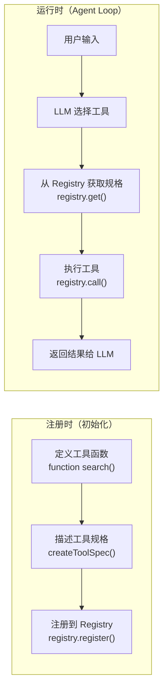
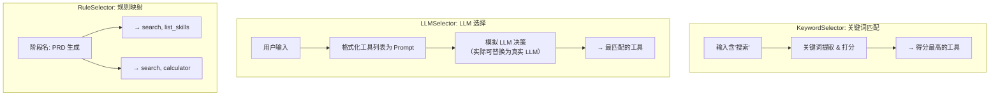

# 第三章：LLM 调用 + Tool Calling + 沙箱

> **一句概括**：把 LLM 接入你的 Agent，定义工具让模型调用，并用沙箱安全执行——这是 Agent 从"玩具"变成"工具"的关键一跃。

---

## 🎯 学习目标

完成本章后，你将能够：

| 问题 | 答案 |
|------|------|
| Tool Calling 的完整流程是什么？ | 发消息+传 Schema → 模型返回 tool_use → 执行工具 → 把结果送回模型 |
| JSON Schema 怎么写？ | `{type, properties, required}` 三要素描述工具参数 |
| Tool Registry 是什么？ | 工具注册表——集中管理所有工具的规格、权限、生命周期 |
| 工具选择有哪几种策略？ | 关键词 / LLM / 规则，各有优劣 |
| 工具调用出错怎么处理？ | 分级错误类型（NotFound / Timeout / Parameter / Permission / Execution）+ 统一处理器 |
| 安全沙箱怎么实现？ | `child_process` 隔离执行 + 路径白名单 + 超时控制 |
| LangChain.js 和我手写的代码是什么关系？ | 框架 vs 手写，概念在 Phase 7 中对照 |

---

## 📖 核心概念

### 3.1 LLM Provider 抽象

> **Phase 3 不包含 LLM Provider 实现。** 实际代码聚焦于工具注册、沙箱执行和工具选择策略，不涉及直接 LLM 调用。LLM Provider 抽象（LLMProvider 抽象类、AnthropicProvider、OpenAIProvider 等）将在 **Phase 7** 中结合 LangChain.js 统一讲解。届时你会看到手写抽象与框架抽象的完整对照。

如果你现在就想了解 LLM Provider 的基本概念：它是 Agent 与 LLM 之间的接口层，定义统一的 `chat()` 方法，子类封装各厂商 API 差异。Phase 7 会提供完整的可运行示例。
---

### 3.2 Tool Calling 协议

Tool Calling 是 Agent 与外部世界通信的核心协议。理解它的完整生命周期，是写出可靠 Agent 的基础。

#### 消息流全景

```
┌─ 你发什么 ──────────────────────────────────────────────┐
│                                                            │
│  messages = [                                              │
│    {"role": "system", "content": "你是..."},               │
│    {"role": "user",   "content": "搜索 RAG 论文"},          │
│  ]                                                         │
│  tools = [                   ← 告诉模型有哪些工具可用        │
│    {"name": "search",                                       │
│     "description": "搜索网络信息",                          │
│     "input_schema": {                                      │
│       "type": "object",                                    │
│       "properties": {                                      │
│         "query": {"type": "string"}                        │
│       },                                                   │
│       "required": ["query"]                                │
│     }}                                                     │
│  ]                                                         │
│                                                            │
├─ 模型返回 ─────────────────────────────────────────────────┤
│  {                                                         │
│    "content": "我来帮你搜索...",                           │
│    "tool_calls": [{                                        │
│      "id": "call_123",                                     │
│      "name": "search",                                     │
│      "input": {"query": "RAG 论文 2024"}                   │
│    }]                                                      │
│  }                                                         │
│                                                            │
├─ 你执行工具 ───────────────────────────────────────────────┤
│  result = search("RAG 论文 2024")                          │
│  → ["论文A: RAG综述", "论文B: 检索增强生成", ...]           │
│                                                            │
├─ 你把结果送回 ─────────────────────────────────────────────┤
│  messages.push({                                           │
│    "role": "tool",                                         │
│    "tool_call_id": "call_123",                             │
│    "content": "论文A: RAG综述..."                          │
│  })                                                        │
│                                                            │
├─ 模型继续（可能再调工具，也可能输出最终答案）─────────────┤
│  "根据搜索结果，2024年RAG的主要进展是..."                   │
│                                                            │
└────────────────────────────────────────────────────────────┘
```

#### Tool Schema 定义

工具的描述格式遵循 JSON Schema 标准。这是模型"看到"的工具描述：

```typescript
// ── 单个 Tool Schema 的结构 ──

interface ToolSchema {
  name: string;              // 工具名称（唯一标识）
  description: string;       // 描述（模型据此判断何时调用）
  input_schema: {
    type: "object";
    properties: Record<string, {
      type: string;
      description?: string;
      enum?: string[];
    }>;
    required: string[];       // 必填参数列表
  };
}
```

用具体例子来理解：

```typescript
// ── 几个真实的 Tool Schema 示例 ──

const weatherSchema = {
  name: "get_weather",
  description: "获取指定城市的当前天气",
  input_schema: {
    type: "object",
    properties: {
      city: {
        type: "string",
        description: "城市名，如'北京'、'上海'",
      },
      unit: {
        type: "string",
        enum: ["celsius", "fahrenheit"],
        description: "温度单位（默认摄氏）",
      },
    },
    required: ["city"],
  },
};

const searchSchema = {
  name: "search",
  description: "搜索网络信息，返回相关结果列表",
  input_schema: {
    type: "object",
    properties: {
      query: { type: "string", description: "搜索关键词" },
      limit: { type: "number", description: "返回结果数量（默认5）" },
    },
    required: ["query"],
  },
};
```

#### 工具结果回传的 Provider 差异

不同 Provider 的 Tool Calling 协议在底层有差异，这就是为什么我们需要 Provider 抽象层：

| Provider | tool_use 格式 | 回传方式 | role 字段 |
|----------|-------------|---------|----------|
| **Anthropic** | content block 中的 `tool_use` 类型 | `type: "tool_result"` 的 content block | `user` |
| **OpenAI** | `choice.message.tool_calls` 数组 | `tool_call_id` 匹配 | `tool` |
| **Google** | `functionCall` 类型 | `functionResponse` | `function` |

```typescript
// ── 工具结果回传的差异对比 ──

// Anthropic 方式：content block 嵌套
const anthropicResult = {
  role: "user",
  content: [{
    type: "tool_result",
    tool_use_id: "call_123",
    content: "搜索结果是...",
  }],
};

// OpenAI 方式：独立的 tool role
const openaiResult = {
  role: "tool",
  tool_call_id: "call_123",
  content: "搜索结果是...",
};
```

> **核心洞察**：Tool Calling 的本质是"模型告诉你它想做什么，你去做，然后把结果告诉它"。模型不做实际操作——它只负责"思考"和"决策"。

---

### 3.3 Tool Registry 模式

随着工具数量增长（从 2-3 个到几十个），你需要一个集中管理的地方。这就是 Tool Registry。

#### ToolSpec：工具的完整规格定义

```typescript
// ── tool_registry.ts ──

interface ToolParameter {
  name: string;
  type: "string" | "number" | "boolean" | "object" | "array";
  description: string;
  required: boolean;
}

interface ToolSpec {
  name: string;                        // 工具名称，唯一标识
  description: string;                 // 工具描述（模型用来判断什么时候用）
  parameters: ToolParameter[];         // 参数定义数组
  returns: string;                     // 返回值描述
  fn: (params: Record<string, unknown>) => Promise<unknown> | unknown;
  timeout?: number;                    // 超时时间（毫秒）
  permission?: string;                 // 权限等级
}

/**
 * 创建 ToolSpec 的工厂函数。
 * 校验必填字段，不设默认值。
 */
function createToolSpec(spec: ToolSpec): ToolSpec {
  if (!spec.name || spec.name.trim().length === 0) {
    throw new ToolError("工具名称不能为空");
  }
  if (!spec.description || spec.description.trim().length === 0) {
    throw new ToolError(`工具 "${spec.name}" 的描述不能为空`);
  }
  if (typeof spec.fn !== "function") {
    throw new ToolError(`工具 "${spec.name}" 必须提供 fn 实现`);
  }
  return { ...spec };
}
```

#### ToolRegistry：注册表的完整实现

```typescript
class ToolRegistry {
  /** 工具注册表：name → ToolSpec */
  private tools: Map<string, ToolSpec> = new Map();
  private records: ToolCallRecord[] = [];

  /** 注册一个工具 */
  register(spec: ToolSpec): void {
    const tool = createToolSpec(spec);
    if (this.tools.has(tool.name)) {
      console.warn(`⚠️ 工具 "${tool.name}" 被重复注册，将覆盖原有定义`);
    }
    this.tools.set(tool.name, tool);
  }

  /** 按名字获取工具规格 */
  get(name: string): ToolSpec | undefined {
    return this.tools.get(name);
  }

  /** 列出所有工具 */
  listTools(): ToolSpec[] {
    return Array.from(this.tools.values());
  }

  /**
   * 调用一个工具（异步，带参数校验、权限检查、超时控制）
   */
  async call(
    name: string,
    params: Record<string, unknown>,
    context?: { permission?: string },
  ): Promise<unknown> {
    const tool = this.tools.get(name);
    if (!tool) {
      throw new ToolNotFoundError(name);
    }

    this.validateParams(tool, params);

    if (tool.permission && context?.permission !== tool.permission) {
      throw new ToolPermissionError(
        name,
        `需要权限 "${tool.permission}"，但当前上下文未提供`,
      );
    }

    const startedAt = new Date();
    const startMs = Date.now();

    try {
      const result = await this.executeWithTimeout(tool, params, startMs);
      this.records.push({
        toolName: name, params, result,
        startedAt, durationMs: Date.now() - startMs, success: true,
      });
      return result;
    } catch (error) {
      const durationMs = Date.now() - startMs;
      this.records.push({
        toolName: name, params, result: null,
        startedAt, durationMs, success: false,
        error: error instanceof Error ? error.message : String(error),
      });
      throw error;
    }
  }
}
```

#### 注册 vs 调用的生命周期



#### 在你的项目中注册工具

以你的 Agent 开发引导器为例，把每个技能注册为一个工具：

```typescript
// ── 初始化时注册所有工具 ──

const registry = new ToolRegistry();

registry.register(createToolSpec({
  name: "analyze_requirement",
  description: "当用户有模糊需求时，调用需求分析工具进行结构化分析",
  parameters: [
    { name: "input", type: "string", description: "用户原始需求", required: true },
  ],
  returns: "结构化需求文档",
  fn: invokeRequirementAnalyzer,
}));

registry.register(createToolSpec({
  name: "search_web",
  description: "搜索网络信息，获取最新数据",
  parameters: [
    { name: "query", type: "string", description: "搜索关键词", required: true },
    { name: "limit", type: "number", description: "返回条数", required: false },
  ],
  returns: "搜索结果列表",
  fn: searchWeb,
}));

registry.register(createToolSpec({
  name: "execute_code",
  description: "在沙箱中执行 JavaScript/TypeScript 代码",
  parameters: [
    { name: "code", type: "string", description: "要执行的代码", required: true },
    { name: "language", type: "string", description: "语言（js/ts）", required: false },
  ],
  returns: "代码执行结果",
  fn: sandboxExecute,
}));
```

#### 在 Agent Loop 中集成 Tool Registry

```typescript
// ── 集成到第二章的 Agent Loop ──

async function agentLoopWithTools(
  registry: ToolRegistry
): Promise<void> {
  const messages: Message[] = [
    { role: "system", content: "你是一个有帮助的助手，可以使用工具回答问题。" },
  ];

  const userInput = "帮我搜索 RAG 2024 年的最新进展";
  messages.push({ role: "user", content: userInput });

  // 第 1 步：调用 LLM（Phase 7 实现），传递 Tool Schema
  // const schemas = getToolSchemas(registry.listTools());
  // const response = await llm.chat(messages, schemas);

  // 第 2 步：处理 tool_calls
  // for (const toolCall of response.toolCalls) {
  //   try {
  //     const result = await registry.call(toolCall.name, toolCall.input);
  //     messages.push({ role: "tool", content: JSON.stringify(result) });
  //   } catch (error) {
  //     const errMsg = error instanceof ToolError
  //       ? handleToolError(error)
  //       : `❌ 未知错误: ${error}`;
  //     messages.push({ role: "tool", content: errMsg });
  //   }
  // }

  // 第 3 步：把工具结果送回 LLM，生成最终回答
  // const finalResponse = await llm.chat(messages);
  // console.log(`🤖 ${finalResponse.content}`);
}
```

---

### 3.4 工具选择策略

当你有多个工具时，Agent 需要决定"当前该调用哪个工具"。Phase 3 提供三种策略，都实现在单个 `tool_selector.ts` 中：



#### 三种策略的对比

| 策略 | 实现成本 | 灵活度 | 可靠性 | 适合场景 |
|------|---------|-------|-------|---------|
| **KeywordSelector** | ⭐ 低 | ❌ 低 | 🟡 中 | 教学 Demo、固定流程 CLI |
| **LLMSelector** | ⭐⭐ 中 | ✅ 高 | ✅ 高 | **推荐**——大多数 Agent 的首选 |
| **RuleSelector** | ⭐ 低 | 🟡 中 | ✅ 高 | 作为兜底策略（fallback） |

#### 抽象基类

所有选择器继承自同一个抽象基类：

```typescript
export abstract class ToolSelector {
  abstract select(input: string, tools: ToolSpec[]): Promise<ToolSpec[]>;
}
```

#### KeywordSelector：关键词匹配

```typescript
// ── tool_selector.ts ──

export class KeywordSelector extends ToolSelector {
  private readonly maxResults: number;

  constructor(maxResults = 5) {
    super();
    this.maxResults = maxResults;
  }

  async select(input: string, tools: ToolSpec[]): Promise<ToolSpec[]> {
    const keywords = this.extractKeywords(input);
    if (keywords.length === 0) return [];

    const scored = tools
      .map((tool) => ({ tool, score: this.calculateScore(tool, keywords) }))
      .filter((entry) => entry.score > 0)
      .sort((a, b) => b.score - a.score);

    return scored.slice(0, this.maxResults).map((entry) => entry.tool);
  }

  private extractKeywords(input: string): string[] {
    const cleaned = input.toLowerCase().replace(/[^\w\u4e00-\u9fff]+/g, " ");
    return cleaned.split(/\s+/).filter((kw) => kw.length > 0);
  }

  private calculateScore(tool: ToolSpec, keywords: string[]): number {
    let score = 0;
    for (const kw of keywords) {
      if (tool.name.toLowerCase().includes(kw)) score += 10;
      if (tool.description.toLowerCase().includes(kw)) score += 5;
      for (const param of tool.parameters) {
        if (param.name.toLowerCase().includes(kw)) score += 2;
      }
    }
    return score;
  }
}
```

#### LLMSelector：模拟 LLM 选择（推荐）

将工具列表格式化为 Prompt，模拟 LLM 决策过程。生产环境可替换为真实 LLM API。

```typescript
export class LLMSelector extends ToolSelector {
  async select(input: string, tools: ToolSpec[]): Promise<ToolSpec[]> {
    const toolListText = tools
      .map((t, i) =>
        `${i + 1}. "${t.name}": ${t.description}` +
        `（参数：${t.parameters.map((p) =>
          `${p.name}: ${p.type}${p.required ? "（必填）" : ""}`
        ).join("，")}）`,
      )
      .join("\n");

    const prompt = `用户输入：${input}\n\n可用工具：\n${toolListText}\n\n请选择最匹配的工具名称，返回格式：["tool_name"]`;

    // 模拟 LLM 响应：关键词匹配后取最高分
    const selector = new KeywordSelector(1);
    return selector.select(input, tools);
  }
}
```

#### RuleSelector：规则映射

根据阶段名称（如"需求分析"、"PRD 生成"）映射到预定义的工具集：

```typescript
export class RuleSelector extends ToolSelector {
  private readonly phaseToolMap: Record<string, string[]>;

  constructor(phaseToolMap?: Record<string, string[]>) {
    super();
    this.phaseToolMap = phaseToolMap ?? {
      "需求分析": ["search", "list_skills"],
      "PRD 生成": ["search", "calculator"],
      "技术规格": ["search", "calculator"],
      "架构设计": ["list_skills", "search"],
      "代码实现": ["calculator", "search"],
    };
  }

  async select(input: string, tools: ToolSpec[]): Promise<ToolSpec[]> {
    const toolNames = this.phaseToolMap[input];
    if (!toolNames || toolNames.length === 0) return [];

    const toolMap = new Map(tools.map((t) => [t.name, t]));
    return toolNames
      .map((name) => toolMap.get(name))
      .filter((t): t is ToolSpec => t !== undefined);
  }
}
```

---

### 3.5 错误处理

工具调用会出错——这是必然的。网络超时、参数错误、权限不足、代码抛异常……没有完善的错误处理，Agent 会在运行时直接崩溃。

#### ToolError 层级结构

```typescript
// ── tool_errors.ts ──
// 工具调用的完整错误类型层级

/**
 * 所有 Tool 错误的基类
 */
export class ToolError extends Error {
  override name = "ToolError";

  constructor(message: string) {
    super(message);
    Object.setPrototypeOf(this, ToolError.prototype);
  }
}

/** 工具不存在：LLM 生成了错误的工具名 */
export class ToolNotFoundError extends ToolError {
  override name = "ToolNotFoundError";

  constructor(toolName: string) {
    super(`工具 "${toolName}" 未注册`);
    Object.setPrototypeOf(this, ToolNotFoundError.prototype);
  }
}

/** 工具调用超时 */
export class ToolTimeoutError extends ToolError {
  override name = "ToolTimeoutError";

  constructor(toolName: string, timeoutMs: number) {
    super(`工具 "${toolName}" 执行超时（${timeoutMs}ms）`);
    Object.setPrototypeOf(this, ToolTimeoutError.prototype);
  }
}

/** 参数校验失败 */
export class ToolParameterError extends ToolError {
  override name = "ToolParameterError";

  constructor(toolName: string, reason: string) {
    super(`工具 "${toolName}" 参数错误：${reason}`);
    Object.setPrototypeOf(this, ToolParameterError.prototype);
  }
}

/** 权限不足 */
export class ToolPermissionError extends ToolError {
  override name = "ToolPermissionError";

  constructor(toolName: string, reason: string) {
    super(`工具 "${toolName}" 权限不足：${reason}`);
    Object.setPrototypeOf(this, ToolPermissionError.prototype);
  }
}

/** 工具执行时内部异常 */
export class ToolExecutionError extends ToolError {
  override name = "ToolExecutionError";

  constructor(toolName: string, cause: string) {
    super(`工具 "${toolName}" 执行失败：${cause}`);
    Object.setPrototypeOf(this, ToolExecutionError.prototype);
  }
}
```

#### 统一错误处理器

```typescript
// ── 错误处理策略 ──

/**
 * 统一的工具错误处理函数。
 * 使用 instanceof 判断错误类型，返回人类可读的错误信息。
 */
export function handleToolError(error: ToolError): string {
  if (error instanceof ToolNotFoundError) {
    return `🔍 ${error.message}。请检查工具名称是否正确。`;
  }
  if (error instanceof ToolTimeoutError) {
    return `⏱️ ${error.message}。请检查工具是否有死循环或等待时间过长。`;
  }
  if (error instanceof ToolParameterError) {
    return `⚙️ ${error.message}。请检查传入的参数格式和类型。`;
  }
  if (error instanceof ToolPermissionError) {
    return `🔒 ${error.message}。请联系管理员获取相应权限。`;
  }
  if (error instanceof ToolExecutionError) {
    return `💥 ${error.message}。请检查依赖服务是否正常运行。`;
  }
  return `❌ 未知工具错误：${error.message}`;
}
```

#### 错误类型与恢复策略

| 错误类型 | 含义 | 建议恢复策略 |
|---------|------|-------------|
| `ToolNotFoundError` | 模型调用了不存在的工具 | 告诉模型正确的工具名，让它重试 |
| `ToolTimeoutError` | 工具执行超过 timeout | 让模型换个方式重试（如简化查询） |
| `ToolParameterError` | 参数格式不对 | 把参数要求告诉模型，让它修正 |
| `ToolPermissionError` | 越权操作 | 如果是合法请求，提示提升权限后重试；否则拒绝 |
| `ToolExecutionError` | 工具内部异常 | 把错误信息返回给模型，让它决定下一步 |

---

### 3.6 沙箱执行

工具不能直接在 Agent 主进程里跑——特别是执行命令、写文件、调外部 API 时。你需要一个**沙箱**来隔离执行环境。

#### ToolSandbox 实现

```typescript
// ── sandbox.ts ──

import { spawn } from "node:child_process";
import { readFile, writeFile, access } from "node:fs/promises";
import { constants } from "node:fs";
import { resolve, normalize } from "node:path";

/**
 * 沙箱配置选项
 */
export interface SandboxOptions {
  allowedPaths: string[];
  allowedCommands?: string[];
  maxOutputSize: number;
  timeout: number;
}

/**
 * 沙箱执行结果
 */
export interface SandboxResult {
  stdout: string;
  stderr: string;
  exitCode: number | null;
  durationMs: number;
}

/**
 * Tool 沙箱 — 安全的命令执行和文件操作环境
 */
export class ToolSandbox {
  readonly allowedPaths: string[];
  readonly allowedCommands: string[];
  readonly maxOutputSize: number;
  readonly timeout: number;

  constructor(options?: Partial<SandboxOptions>) {
    this.allowedPaths = options?.allowedPaths ?? [];
    this.allowedCommands = options?.allowedCommands ?? ["node", "python3", "tsx"];
    this.maxOutputSize = options?.maxOutputSize ?? 1024 * 100; // 100KB
    this.timeout = options?.timeout ?? 30_000;                 // 30s
  }

  /**
   * 在沙箱中执行脚本
   * 通过 child_process.spawn 隔离执行，带有超时和输出大小控制。
   */
  async runScript(
    script: string,
    options?: { command?: string; args?: string[] },
  ): Promise<SandboxResult> {
    const command = options?.command ?? "node";
    const args = options?.args ?? ["-e", script];

    if (!this.allowedCommands.includes(command)) {
      return {
        stdout: "",
        stderr: `命令 "${command}" 不在允许列表中`,
        exitCode: 1,
        durationMs: 0,
      };
    }

    const startMs = Date.now();

    return new Promise<SandboxResult>((resolvePromise) => {
      const child = spawn(command, args, {
        stdio: ["pipe", "pipe", "pipe"],
        timeout: this.timeout,
      });

      let stdout = "";
      let stderr = "";
      let stdoutTruncated = false;
      let stderrTruncated = false;

      const timer = setTimeout(() => child.kill("SIGTERM"), this.timeout);

      child.stdout?.on("data", (chunk: Buffer) => {
        if (stdout.length < this.maxOutputSize) {
          stdout += chunk.toString("utf-8");
          if (stdout.length > this.maxOutputSize) {
            stdout = stdout.slice(0, this.maxOutputSize);
            stdoutTruncated = true;
          }
        }
      });

      child.stderr?.on("data", (chunk: Buffer) => {
        if (stderr.length < this.maxOutputSize) {
          stderr += chunk.toString("utf-8");
          if (stderr.length > this.maxOutputSize) {
            stderr = stderr.slice(0, this.maxOutputSize);
            stderrTruncated = true;
          }
        }
      });

      child.on("close", (exitCode) => {
        clearTimeout(timer);
        const durationMs = Date.now() - startMs;
        resolvePromise({
          stdout: stdoutTruncated ? stdout + "\n...（输出已截断）" : stdout,
          stderr: stderrTruncated ? stderr + "\n...（输出已截断）" : stderr,
          exitCode,
          durationMs,
        });
      });

      child.on("error", (err) => {
        clearTimeout(timer);
        resolvePromise({
          stdout, stderr: `进程错误：${err.message}`,
          exitCode: 1, durationMs: Date.now() - startMs,
        });
      });
    });
  }

  /** 安全地读取文件 — 检查路径是否在白名单内 */
  async readFile(filePath: string): Promise<string> {
    const resolvedPath = this.resolvePath(filePath);
    this.assertPathAllowed(resolvedPath);

    try {
      await access(resolvedPath, constants.R_OK);
    } catch {
      throw new Error(`文件 "${resolvedPath}" 不存在或不可读`);
    }

    return await readFile(resolvedPath, "utf-8");
  }

  /** 安全地写入文件 — 检查路径是否在白名单内 */
  async writeFile(filePath: string, content: string): Promise<void> {
    const resolvedPath = this.resolvePath(filePath);
    this.assertPathAllowed(resolvedPath);
    await writeFile(resolvedPath, content, "utf-8");
  }

  private resolvePath(filePath: string): string {
    return normalize(resolve(filePath));
  }

  private assertPathAllowed(resolvedPath: string): void {
    if (this.allowedPaths.length === 0) return;
    const allowed = this.allowedPaths.some((p) =>
      resolvedPath.startsWith(normalize(resolve(p)))
    );
    if (!allowed) {
      throw new Error(
        `路径 "${resolvedPath}" 不在允许的白名单中`,
      );
    }
  }
}
```

#### 使用示例

```typescript
// ── 沙箱使用示例 ──

const sandbox = new ToolSandbox({
  allowedPaths: ["/tmp"],
  allowedCommands: ["node"],
  maxOutputSize: 1024,
  timeout: 5000,
});

// 1. 安全执行脚本
const result = await sandbox.runScript(
  "console.log('总和:', [1,2,3,4,5].reduce((a,b) => a + b, 0));"
);
console.log(result.stdout); // 总和: 15
console.log(`退出码: ${result.exitCode}, 耗时: ${result.durationMs}ms`);

// 2. 路径越权测试
try {
  await sandbox.readFile("/etc/passwd");
} catch (e) {
  console.log(e.message); // 路径 "/etc/passwd" 不在允许的白名单中
}

// 3. 超时测试（SIGTERM 杀死）
const timeoutResult = await sandbox.runScript("while(true) {}");
console.log(timeoutResult.exitCode); // null（被信号终止）
```

#### 沙箱的核心原则

| 原则 | 实现方式 | 为什么重要 |
|------|---------|-----------|
| **最小权限** | 工具只访问它需要的最小资源集 | 减少攻击面 |
| **路径白名单** | 只允许读/写指定的目录 | 防止 Agent 读写系统关键文件 |
| **命令白名单** | 只允许执行预先批准的命令 | 防止执行恶意命令（如 `rm -rf /`） |
| **资源限制** | 输出大小（100KB）有上限 | 防止无限输出耗尽内存 |
| **超时控制** | 30s 超时 + SIGTERM 终止 | 防止卡死整个 Agent Loop |
| **异步执行** | `child_process.spawn` + Promise | 不阻塞主进程 |

---

### 3.7 LangChain.js 概念预览

> **Phase 3 不包含 LangChain.js 代码**。LangChain.js 集成将在 **Phase 7** 中结合手写 Provider 抽象统一讲述。

本章你手写的概念（ToolSpec、ToolRegistry、ToolSelector、ToolSandbox）在 LangChain.js 中有直接对应：

| 手写概念 | LangChain.js 对应 |
|---------|------------------|
| `ToolSpec` + `ToolRegistry` | `DynamicStructuredTool` + `tool[]` 数组 |
| `ToolSelector` | Agent 内置的 Tool Calling 机制 |
| `ToolSandbox` | 需自行实现（框架不提供沙箱） |
| `handleToolError` | 框架自动捕获并回传错误给 LLM |

Phase 7 会展示完整对照，包括真实的 LLM 调用示例。

---

## 🛠️ 动手练习

### 练习 1：运行 Phase 3 主入口

```bash
npm run phase3
```

观察演示程序的四个步骤：注册工具、错误处理、工具选择器、沙箱执行。

### 练习 2：注册自定义工具

1. 打开 `src/index.ts`，参考 `search` 和 `calculator` 的写法，注册一个新工具
2. 调用 `registry.call()` 验证你的工具可以正常工作
3. 尝试注册一个参数校验失败的场景，观察 `ToolParameterError`

### 练习 3：把 Phase 2 的 if-else 改成 Tool Registry

1. 打开第二章的 `handlers.ts`，把每个 handler 函数封装成 `ToolSpec`
2. 注册到 `ToolRegistry`
3. 修改 `agentLoop`，通过 `await registry.call()` 调用工具
4. 对比代码量变化

```typescript
// 改造示例
const handlers = {
  query_phase: createToolSpec({
    name: "query_phase",
    description: "查询当前开发阶段",
    parameters: [],
    fn: () => handleQueryPhase(state),
  }),
  next_step: createToolSpec({
    name: "next_step",
    description: "查看下一步做什么",
    parameters: [],
    fn: () => handleNextStep(state),
  }),
  // ... 其余意图同理
};
```

### 练习 4：体验沙箱安全机制

1. 用 `ToolSandbox` 包裹工具执行
2. 创建一个读取 `/etc/passwd` 的调用，验证沙箱阻止越权访问
3. 创建一个死循环脚本，验证超时 SIGTERM 生效

```typescript
// 测试沙箱越权
const sandbox = new ToolSandbox({
  allowedPaths: ["/tmp"],
  allowedCommands: ["node"],
});
try {
  await sandbox.readFile("/etc/passwd");
} catch (e: unknown) {
  console.log((e as Error).message); // 白名单拒绝
}
```

### 练习 5：配合选择器实现工具路由

1. 注册三个工具，分别用于搜索、计算和列表查询
2. 使用 `KeywordSelector` 根据用户输入自动匹配合适的工具
3. 使用 `RuleSelector` 根据阶段名映射到指定工具集

```typescript
const selector = new KeywordSelector(2);
const matched = await selector.select("帮我计算 2+2", tools);
// matched → [calculator]
```
---

## 📦 阶段产出物

完成本章后，你的项目结构应包含：

```
agentDev/
├── src/
│   ├── index.ts                 # 主入口（演示注册、错误、选择器、沙箱）
│   ├── tool_registry.ts         # 工具注册表 + ToolSpec + ToolParameter
│   ├── tool_errors.ts           # 工具错误类型层级 + 统一处理器
│   ├── tool_selector.ts         # 工具选择器（Keyword / LLM / Rule）
│   └── sandbox.ts               # 沙箱执行器（spawn + 白名单 + 超时）
├── tests/
│   └── test_registry.test.ts    # Tool Registry 单元测试
├── package.json
└── tsconfig.json
```

**验收标准**：
- [ ] `npm run phase3` 能正常启动并依次展示四个演示模块
- [ ] `ToolRegistry` 支持注册/查询/列表，参数校验正确拦截非法输入
- [ ] 权限检查和超时控制正常工作
- [ ] `KeywordSelector` 能根据关键词正确匹配工具
- [ ] `RuleSelector` 能根据阶段名映射到预定义工具集
- [ ] 沙箱阻止越权路径访问
- [ ] 沙箱超时机制能杀死死循环脚本
- [ ] 测试全部通过：`npx vitest run phases/phase-3-tools-sandbox/tests/`

---

## 📊 自测清单

完成本章的学习后，逐项确认：

- [ ] 我能画出 Tool Calling 的完整消息流图（发 Schema → tool_use → 执行 → 回传）
- [ ] 我能用 TypeScript 实现一个完整的 `ToolRegistry`（register / get / listTools / call）
- [ ] 我能说出 `ToolSpec` 中 `ToolParameter[]` 数组的结构和类型校验逻辑
- [ ] 我能解释三种工具选择策略（Keyword / LLM / Rule）的优劣和适用场景
- [ ] 我能实现分级 ToolError 类型（至少 4 种）和统一错误处理函数
- [ ] 我能用 `child_process.spawn` 实现沙箱隔离执行
- [ ] 我知道路径白名单、超时控制、输出限制的意义和实现方式
- [ ] 我能说出 LangChain.js 中 `DynamicStructuredTool` 对应的手写概念
- [ ] [进阶] 我能将沙箱集成到 ToolRegistry 的 `call()` 中，实现安全执行

---

## 🔗 延伸阅读

| 资源 | 链接 | 说明 |
|------|------|------|
| **Anthropic: Tool Use 文档** | https://docs.anthropic.com/en/docs/build-with-claude/tool-use | Claude 的 Tool Calling 规范，包含 Tool Schema 格式和最佳实践 |
| **OpenAI: Function Calling 指南** | https://platform.openai.com/docs/guides/function-calling | OpenAI 的函数调用能力，与 Anthropic 协议对比 |
| **JSON Schema 标准** | https://json-schema.org/ | Tool Schema 的底层标准，了解 type, properties, required 等 |
| **MCP: Model Context Protocol** | https://modelcontextprotocol.io/ | 标准化的工具协议，让你的工具可以被任何 MCP 客户端发现 |
| **LangChain.js 入门指南** | https://js.langchain.com/docs/get_started/introduction | TypeScript Agent 框架，本章概念在框架中的映射 |
| **LangChain.js Agent Types** | https://js.langchain.com/docs/modules/agents/agent_types/ | 各种 Agent 类型（Tool Calling / Structured Chat / ReAct）对比 |
| **Vercel AI SDK: Tools** | https://sdk.vercel.ai/docs/ai-sdk-ui/tools | 前端友好的工具调用实现，适合 Next.js + React 项目 |

---

> **下一章预告**：第四章「上下文 + 记忆 + 安全」——Agent 怎么"记住"之前说过的话？Content 超出 Token 限制怎么办？怎么防止 Prompt Injection？
