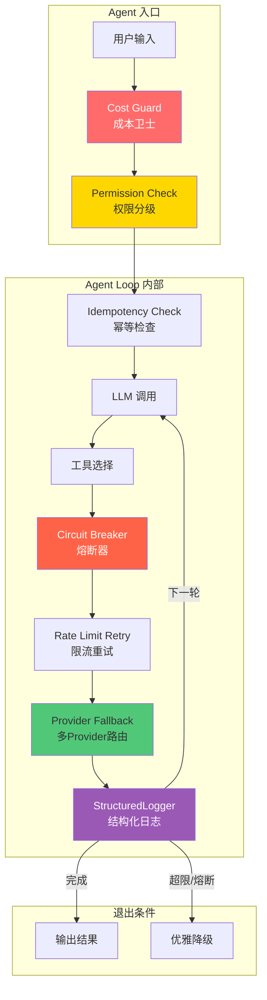
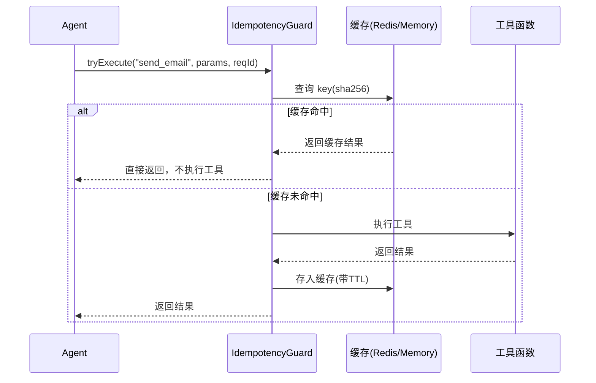
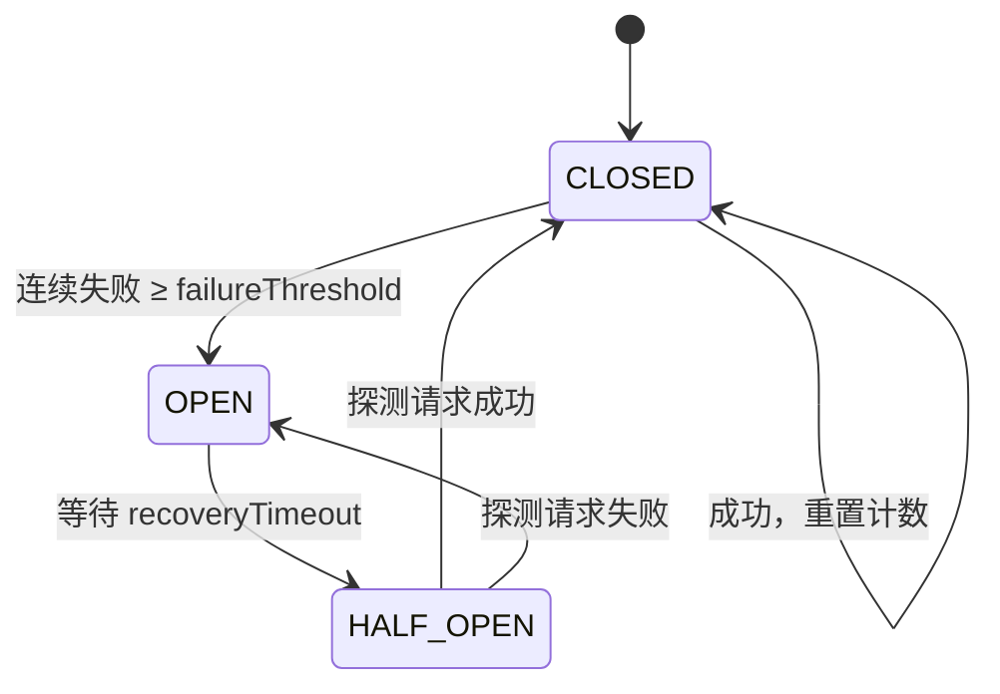
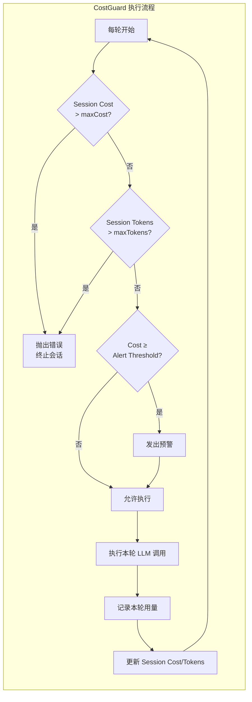
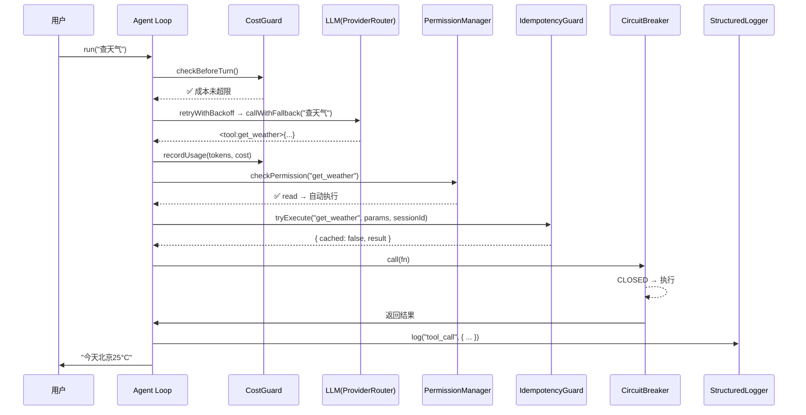

# 第六章：生产级可靠性

> Agent 能跑起来不意味着能上线——幂等、熔断、限流、降级、成本审计，六个模式构成生产级 Agent 的可靠性骨架。本章教你用"可靠性六件套"把 Agent 从玩具变成产品。

---

## 🎯 学习目标

完成本章后，你将能够：

| 问题 | 答案 |
|------|------|
| 幂等性解决什么问题？ | 同一个请求执行多次和一次的效果相同，防止重复发送邮件/重复扣款 |
| Circuit Breaker 的状态怎么流转？ | CLOSED → 连续失败 N 次 → OPEN → timeout → HALF_OPEN → 成功 → CLOSED |
| 指数退避为什么需要 jitter？ | 防止大量客户端同时重试造成"惊群效应" |
| Provider Fallback 怎么设计？ | 主 Provider 失败后按优先级切换到备用 Provider |
| Cost Guard 需要设哪些上限？ | 单轮成本、单会话成本、单会话 Token 数，以及预警阈值 |
| 权限分几级？各怎么处理？ | Read（自动执行）/ Write（确认后执行）/ Dangerous（严格确认+二次验证） |
| 结构化日志比 console.log 好在哪？ | 可程序化分析、可回放、可归因——日志即事件流 |

---

## 📖 核心概念

### 6.1 可靠性六件套架构

把可靠性组件嵌入 Agent Loop，形成一个**防御层叠**的架构：



**六个组件的职责和顺序逻辑：**

| # | 组件 | 检查时机 | 失败时的行为 |
|---|------|----------|-------------|
| 1 | **Cost Guard** | 每轮入口 | 超限 → 抛出 `CostLimitExceededError`，终止会话 |
| 2 | **Permission Manager** | 工具调用前 | 无权限 → 请求确认或直接拒绝 |
| 3 | **Idempotency Guard** | 工具调用前 | 已执行 → 返回缓存结果，不重复执行 |
| 4 | **Circuit Breaker** | 工具调用前 | 熔断中 → 抛出 `CircuitBreakerOpenError`，跳过工具 |
| 5 | **Rate Limit Retry** | 工具调用后 | 限流 → 指数退避重试，耗尽后走 fallback |
| 6 | **Structured Logger** | 所有关键节点 | 无失败行为——只记录，不阻断 |

> **设计原则**：这六个组件应按图中顺序编排。Cost Guard 放在最外层是因为"成本是最高优先级的约束"——如果已经没钱了，后续所有工作都没有意义。

---

### 6.2 Idempotency Guard（幂等守卫）

幂等性保证了同一个请求无论被提交一次还是多次，最终结果都是相同的。这对 Agent 尤为重要，因为 LLM 调用可能因网络超时而重试，但重试后不应该重复发送邮件或扣款。



```typescript
// ── idempotency.ts ──
// 幂等守卫：确保同一个 requestId 的工具调用只执行一次
// 返回 { cached, result } 结构，调用方可知是否命中缓存
// 内置危险工具列表，可通过 requireConfirmation() 查询

import { createHash } from "node:crypto";

interface CacheEntry {
  result: unknown;
  expiresAt: number;
}

export class IdempotencyGuard {
  private cache = new Map<string, CacheEntry>();
  private readonly defaultTTL: number;
  private dangerousTools: Set<string>;

  /**
   * @param defaultTTL - TTL in milliseconds (default 5 minutes)
   */
  constructor(defaultTTL: number = 300_000) {
    this.defaultTTL = defaultTTL;
    this.dangerousTools = new Set(["delete_file", "execute_shell", "modify_system"]);
  }

  /**
   * Generate a SHA-256 hash key from tool call parameters.
   */
  generateKey(toolName: string, params: Record<string, unknown>, requestId: string): string {
    const payload = JSON.stringify({ toolName, params, requestId });
    return createHash("sha256").update(payload).digest("hex");
  }

  /**
   * 幂等执行
   * - 已缓存 → 返回 { cached: true, result }
   * - 未缓存 → 执行 fn 并缓存结果
   */
  async tryExecute<T>(
    toolName: string,
    params: Record<string, unknown>,
    requestId: string,
    fn: () => Promise<T>,
  ): Promise<{ cached: boolean; result: T }> {
    this.cleanup();
    const key = this.generateKey(toolName, params, requestId);
    const existing = this.cache.get(key);
    if (existing && existing.expiresAt > Date.now()) {
      return { cached: true, result: existing.result as T };
    }
    const result = await fn();
    this.cache.set(key, { result, expiresAt: Date.now() + this.defaultTTL });
    return { cached: false, result };
  }

  /**
   * 检查指定工具是否需要二次确认
   */
  requireConfirmation(toolName: string): boolean {
    return this.dangerousTools.has(toolName);
  }

  /**
   * 注册一个危险工具（执行前需二次确认）
   */
  registerDangerousTool(toolName: string): void {
    this.dangerousTools.add(toolName);
  }

  /** 清理过期缓存项 */
  cleanup(): number {
    const now = Date.now();
    let removed = 0;
    for (const [key, entry] of this.cache) {
      if (entry.expiresAt <= now) {
        this.cache.delete(key);
        removed++;
      }
    }
    return removed;
  }

  /** 清空全部缓存 */
  clear(): void {
    this.cache.clear();
  }

  /** 当前缓存条目数 */
  get size(): number {
    return this.cache.size;
  }
}
```

**幂等性适用场景对照表：**

| 工具类型 | 是否需幂等 | 理由 |
|----------|-----------|------|
| `get_weather` | ❌ | 只读查询，重复调用无副作用 |
| `send_email` | ✅ | 重复发送会造成用户收到多封邮件 |
| `charge_credit` | ✅ | 重复扣款是严重生产事故 |
| `search_docs` | ❌ | 只读搜索，重复无影响 |
| `delete_file` | ✅ | 需幂等 + 权限双重保护 |
| `write_file` | ⚠️ | 看场景：append 模式不安全，overwrite 模式安全 |

---

### 6.3 Circuit Breaker（熔断器）

熔断器防止故障蔓延。当一个工具连续失败达到阈值，熔断器"跳闸"，后续请求直接失败而不真正调用工具，给下游系统喘息恢复的时间。



**Microsoft Agent Governance Toolkit 推荐的熔断参数：**

| 参数 | 推荐值 | 说明 |
|------|--------|------|
| `failureThreshold` | 5 | 连续失败 5 次跳闸（比默认 3 更稳健，避免偶发抖动误触发） |
| `recoveryTimeout` | 60s | 等待 60 秒后进入半开状态 |
| `halfOpenMaxCalls` | 1 | 半开状态下只放行 1 个探测请求（保守策略） |

>Cencori 针对 LLM Provider 的实践建议：不同 Provider 应该共享独立的熔断器。比如 OpenAI 熔断了不应该影响 Anthropic 的请求。每个 Provider 实例拥有自己的 `failureThreshold` 和 `recoveryTimeout`。

```typescript
// ── circuit_breaker.ts ──

export type CircuitState = "closed" | "open" | "half_open";

export class CircuitBreakerOpenError extends Error {
  constructor(message?: string) {
    super(message ?? "Circuit breaker is OPEN – request rejected");
    this.name = "CircuitBreakerOpenError";
  }
}

export class CircuitBreaker {
  state: CircuitState = "closed";
  failureCount = 0;
  lastFailureTime: number | null = null;
  totalTrips = 0;

  private readonly failureThreshold: number;
  private readonly recoveryTimeoutMs: number;
  private readonly halfOpenMaxCalls: number;
  private halfOpenCalls = 0;

  /**
   * @param failureThreshold - 连续失败次数阈值（默认 5）
   * @param recoveryTimeoutMs - 半开恢复等待时间（默认 60s）
   * @param halfOpenMaxCalls - 半开状态下最大探测请求数（默认 1）
   */
  constructor(
    failureThreshold: number = 5,
    recoveryTimeoutMs: number = 60_000,
    halfOpenMaxCalls: number = 1,
  ) {
    this.failureThreshold = failureThreshold;
    this.recoveryTimeoutMs = recoveryTimeoutMs;
    this.halfOpenMaxCalls = halfOpenMaxCalls;
  }

  /** 检查熔断器是否接受请求 */
  isAvailable(): boolean {
    this.evaluateState();
    return this.state !== "open";
  }

  /** 带熔断保护的调用 */
  async call<T>(fn: () => Promise<T>): Promise<T> {
    this.evaluateState();

    if (this.state === "open") {
      throw new CircuitBreakerOpenError(
        `Circuit breaker is OPEN (failureCount=${this.failureCount})`,
      );
    }

    if (this.state === "half_open" && this.halfOpenCalls >= this.halfOpenMaxCalls) {
      throw new CircuitBreakerOpenError(
        "Circuit breaker is HALF_OPEN and max test calls reached",
      );
    }

    this.halfOpenCalls++;

    try {
      const result = await fn();
      this.recordSuccess();
      return result;
    } catch (err) {
      this.recordFailure();
      throw err;
    }
  }

  /** 记录成功，重置熔断器 */
  recordSuccess(): void {
    this.state = "closed";
    this.failureCount = 0;
    this.lastFailureTime = null;
    this.halfOpenCalls = 0;
  }

  /** 记录失败，可能打开熔断器 */
  recordFailure(): void {
    this.lastFailureTime = Date.now();
    this.failureCount++;

    if (this.state === "half_open" || this.failureCount >= this.failureThreshold) {
      this.state = "open";
      this.totalTrips++;
    }

    this.halfOpenCalls = 0;
  }

  /** 重置熔断器——在人工介入或降级策略中调用 */
  reset(): void {
    this.state = "closed";
    this.failureCount = 0;
    this.lastFailureTime = null;
    this.totalTrips = 0;
    this.halfOpenCalls = 0;
  }

  /** 内部状态评估——OPEN 超时后自动转 HALF_OPEN */
  private evaluateState(): void {
    if (
      this.state === "open" &&
      this.lastFailureTime !== null &&
      Date.now() - this.lastFailureTime >= this.recoveryTimeoutMs
    ) {
      this.state = "half_open";
      this.halfOpenCalls = 0;
    }
  }
}
```

---

### 6.4 Rate Limit Retry + Provider Fallback

**TrueFoundry 的三层限流网关模型**告诉我们，生产环境需要分层处理限流：

1. **客户端限流**（本章实现）：客户端的指数退避 + jitter
2. **网关限流**（API Gateway）：全局速率限制，按 IP/API Key 分桶
3. **Provider 限流**（LLM 服务端）：模型级别的配额管理

Agent 层面可控制的是第 1 层（客户端重试）和第 3 层（Provider 切换）。

```typescript
// ── rate_limiter.ts ──
// 指数退避重试 + ProviderRouter（多 Provider 路由）
// 合并文件：rate_limiter 和 provider 路由在同一文件中

export class RateLimitError extends Error {
  constructor(message?: string) {
    super(message ?? "Rate limit exceeded");
    this.name = "RateLimitError";
  }
}

export class AllProvidersFailedError extends Error {
  constructor(message?: string) {
    super(message ?? "All providers failed");
    this.name = "AllProvidersFailedError";
  }
}

/**
 * 指数退避 + jitter 重试
 *
 * 策略：
 * - 第 1 次退避：baseDelay × (0.5 ~ 1.5) × 2⁰
 * - 第 2 次退避：baseDelay × (0.5 ~ 1.5) × 2¹
 * - 第 3 次退避：baseDelay × (0.5 ~ 1.5) × 2²
 *
 * jitter 取 ±50% 随机范围，防止"惊群效应"
 * 仅对 RateLimitError 重试，其他错误立即抛出
 */
export async function retryWithBackoff<T>(
  fn: () => Promise<T>,
  maxRetries: number = 3,
  baseDelayMs: number = 1000,
  enableJitter: boolean = true,
): Promise<T> {
  let lastError: Error | undefined;

  for (let attempt = 0; attempt <= maxRetries; attempt++) {
    try {
      return await fn();
    } catch (err: unknown) {
      lastError = err instanceof Error ? err : new Error(String(err));

      if (!(lastError instanceof RateLimitError)) {
        throw lastError;
      }

      if (attempt >= maxRetries) {
        throw lastError;
      }

      const delay = baseDelayMs * Math.pow(2, attempt);
      const jitter = enableJitter
        ? delay * 0.5 * (2 * Math.random() - 1) // ±50%
        : 0;
      const finalDelay = Math.max(0, delay + jitter);

      await new Promise((resolve) => setTimeout(resolve, finalDelay));
    }
  }

  throw lastError!;
}

export interface Provider {
  name: string;
  model: string;
  call(prompt: string): Promise<string>;
}

/**
 * 多 Provider 路由：主 Provider 限流后自动切换到备用 Provider
 */
export class ProviderRouter {
  private providers: Provider[];
  private currentIndex = 0;

  constructor(providers: Provider[]) {
    if (providers.length === 0) {
      throw new Error("At least one provider is required");
    }
    this.providers = providers;
  }

  /**
   * 带 fallback 的调用，返回 { result, provider, model }
   *
   * 顺序遍历 provider，遇 RateLimitError 跳过，其余错误直接抛出。
   */
  async callWithFallback(prompt: string): Promise<{ result: string; provider: string; model: string }> {
    const errors: Array<{ provider: string; error: Error }> = [];

    for (let i = 0; i < this.providers.length; i++) {
      const index = (this.currentIndex + i) % this.providers.length;
      const provider = this.providers[index];

      try {
        const result = await provider.call(prompt);
        this.currentIndex = (index + 1) % this.providers.length;
        return { result, provider: provider.name, model: provider.model };
      } catch (err: unknown) {
        const error = err instanceof Error ? err : new Error(String(err));
        if (error instanceof RateLimitError) {
          errors.push({ provider: provider.name, error });
          continue;
        }
        throw error;
      }
    }

    throw new AllProvidersFailedError(
      `All providers failed. Errors: ${errors.map((e) => `${e.provider}: ${e.error.message}`).join("; ")}`,
    );
  }
}
```

**Provider 配置示例：**

```typescript
const providers: Provider[] = [
  {
    name: "claude-sonnet",
    model: "claude-3-sonnet-20240229",
    call: (prompt) => callAnthropic("claude-3-sonnet", prompt),
  },
  {
    name: "claude-haiku",
    model: "claude-3-haiku-20240307",
    call: (prompt) => callAnthropic("claude-3-haiku", prompt),
  },
  {
    name: "openai-gpt4o",
    model: "gpt-4o",
    call: (prompt) => callOpenAI("gpt-4o", prompt),
  },
];
```

---

### 6.5 Cost Guard（成本卫士）

Cost Guard 是可靠性六件套中**最先执行**的组件。它在每轮 Agent Loop 开始前检查成本配额，防止"无限循环烧钱"——这是生产环境最容易被忽视的风险。



```typescript
// ── cost_guard.ts ──

export class CostLimitExceededError extends Error {
  constructor(message: string) {
    super(message);
    this.name = "CostLimitExceededError";
  }
}

export interface CostConfig {
  maxCostPerSession: number;
  maxCostPerTurn: number;
  maxTokensPerSession: number;
  alertThreshold: number;
}

interface CostUsage {
  cost: number;
  tokens: number;
  timestamp: number;
}

export class CostGuard {
  private config: CostConfig;
  private turnCost = 0;
  private turnTokens = 0;
  private sessionCost = 0;
  private sessionTokens = 0;
  private usageLog: CostUsage[] = [];
  private alertFired = false;

  constructor(config: CostConfig) {
    this.config = config;
  }

  /**
   * 每轮开始前检查
   * - 如果会话总成本超过上限 → 抛出异常
   * - 如果会话总 Token 超过上限 → 抛出异常
   * - 同时重置本轮计数器
   */
  checkBeforeTurn(): void {
    if (this.sessionCost >= this.config.maxCostPerSession) {
      throw new CostLimitExceededError(
        `Session cost limit reached: $${this.sessionCost.toFixed(4)} >= $${this.config.maxCostPerSession.toFixed(4)}`,
      );
    }
    if (this.sessionTokens >= this.config.maxTokensPerSession) {
      throw new CostLimitExceededError(
        `Session token limit reached: ${this.sessionTokens} >= ${this.config.maxTokensPerSession}`,
      );
    }
    this.turnCost = 0;
    this.turnTokens = 0;
  }

  /**
   * 每轮结束后记录用量
   * 当成本达到 alertThreshold 百分比时打印预警
   */
  recordUsage(tokens: number, cost: number): void {
    this.turnCost += cost;
    this.turnTokens += tokens;
    this.sessionCost += cost;
    this.sessionTokens += tokens;
    this.usageLog.push({ cost, tokens, timestamp: Date.now() });

    if (
      !this.alertFired &&
      this.sessionCost >= this.config.maxCostPerSession * this.config.alertThreshold
    ) {
      console.warn(
        `CostGuard Alert: Session cost $${this.sessionCost.toFixed(4)} has reached ${(this.config.alertThreshold * 100).toFixed(0)}% of limit $${this.config.maxCostPerSession.toFixed(4)}`,
      );
      this.alertFired = true;
    }
  }

  /** 获取总会话成本 */
  getSessionCost(): number {
    return this.sessionCost;
  }

  /** 获取总会话 Token 数 */
  getSessionTokens(): number {
    return this.sessionTokens;
  }

  /** 获取本轮成本 */
  getTurnCost(): number {
    return this.turnCost;
  }

  /** 获取本轮 Token 数 */
  getTurnTokens(): number {
    return this.turnTokens;
  }

  /** 获取全部用量记录 */
  getUsageLog(): CostUsage[] {
    return [...this.usageLog];
  }

  /** 重置——新会话时调用 */
  reset(): void {
    this.turnCost = 0;
    this.turnTokens = 0;
    this.sessionCost = 0;
    this.sessionTokens = 0;
    this.usageLog = [];
    this.alertFired = false;
  }
}
```

**成本配置建议（开发和生产环境不同）：**

| 项目 | 开发环境 | 生产环境（保守） | 生产环境（宽松） |
|------|---------|-----------------|-----------------|
| maxCostPerSession | $0.10 | $0.50 | $2.00 |
| maxCostPerTurn | $0.02 | $0.10 | $0.50 |
| maxTokensPerSession | 10K | 50K | 200K |
| alertThreshold | $0.08 | $0.40 | $1.50 |

---

### 6.6 Permission Tier（权限分级）

> **Anthropic "Building effective agents" 的核心洞见之一**：Agent 的自主性必须与权限控制成正比。越自主的 Agent，权限粒度应该越细。

Permission Manager 按三级权限模型，在工具调用前执行拦截：

| 等级 | 标识 | 行为 | 适用工具 |
|------|------|------|---------|
| 🔵 **Read** | `read` | 自动执行，不需要用户确认 | `search`, `get_file`, `read_db` |
| 🟡 **Write** | `write` | Dry-run 预览 + 一次确认 | `send_email`, `write_file`, `create_order` |
| 🔴 **Dangerous** | `dangerous` | 详细警告 + 二次确认 | `delete_file`, `execute_command`, `drop_table` |

```typescript
// ── permission.ts ──

import { createInterface } from "node:readline/promises";
import { stdin as input, stdout as output } from "node:process";

export type PermissionLevel = "read" | "write" | "dangerous";

export interface PermissionCheckResult {
  approved: boolean;
  mode: "auto" | "dry_run" | "confirmed" | "rejected";
}

export type ConfirmFn = (prompt: string) => Promise<boolean>;

/** 默认交互式确认（使用 readline） */
async function defaultConfirm(prompt: string): Promise<boolean> {
  const rl = createInterface({ input, output });
  try {
    const answer = await rl.question(`${prompt} (y/N) `);
    return answer.trim().toLowerCase() === "y";
  } finally {
    rl.close();
  }
}

export class PermissionManager {
  private permissions: Map<string, PermissionLevel>;
  private confirmFn: ConfirmFn;

  /**
   * @param confirmFn - 自定义确认函数（测试时可传入 () => Promise.resolve(true)）
   */
  constructor(confirmFn?: ConfirmFn) {
    this.permissions = new Map();
    this.confirmFn = confirmFn ?? defaultConfirm;
  }

  /** 注册或更新工具的权限等级 */
  registerToolPermission(toolName: string, level: PermissionLevel): void {
    this.permissions.set(toolName, level);
  }

  /** 移除工具的权限注册 */
  unregisterToolPermission(toolName: string): void {
    this.permissions.delete(toolName);
  }

  /** 获取工具的权限等级（未注册默认为 read） */
  getPermissionLevel(toolName: string): PermissionLevel {
    return this.permissions.get(toolName) ?? "read";
  }

  /**
   * 检查权限
   * - read → 自动通过，返回 { approved: true, mode: "auto" }
   * - write → dry-run 预览 + 用户确认
   * - dangerous → 严格警告 + 用户确认
   *
   * 返回 PermissionCheckResult 而非 boolean，提供更丰富的决策信息
   */
  async checkPermission(
    toolName: string,
    params: Record<string, unknown>,
  ): Promise<PermissionCheckResult> {
    const level = this.getPermissionLevel(toolName);

    if (level === "read") {
      return { approved: true, mode: "auto" };
    }

    if (level === "write") {
      const preview = JSON.stringify(params, null, 2);
      const ok = await this.confirmFn(
        `[Dry-Run] Tool: ${toolName}\nParams:\n${preview}\n\nProceed?`,
      );
      return { approved: ok, mode: ok ? "dry_run" : "rejected" };
    }

    // dangerous
    const preview = JSON.stringify(params, null, 2);
    const ok = await this.confirmFn(
      `[DANGEROUS] Tool: ${toolName}\nParams:\n${preview}\n\nType 'yes' to confirm:`,
    );
    return { approved: ok, mode: ok ? "confirmed" : "rejected" };
  }

  /** 替换确认函数（主要用于测试） */
  setConfirmFn(fn: ConfirmFn): void {
    this.confirmFn = fn;
  }
}
```

---

### 6.7 Structured Logger（结构化日志）

> **12 Factor App 原则**：日志是事件流。Agent 的每一步都是一个事件——完整记录这些事件，才能在生产环境中调试、归因和优化。

```typescript
// ── logger.ts ──
// 结构化日志：JSONL 格式写入文件，同步输出可读日志到控制台
// 异步 flush 机制，支持缓冲批量写入

import { appendFile, mkdir } from "node:fs/promises";
import { existsSync } from "node:fs";
import { join, dirname } from "node:path";

export type LogEventType = "llm_call" | "tool_call" | "error" | "cost_check" | "permission_check";

export interface LogEntry {
  timestamp: string;
  eventType: LogEventType;
  data: Record<string, unknown>;
}

const EVENT_ICONS: Record<LogEventType, string> = {
  llm_call: "🧠",
  tool_call: "✅",
  error: "❌",
  cost_check: "💰",
  permission_check: "🔒",
};

export class StructuredLogger {
  private logPath: string;
  private buffer: LogEntry[] = [];
  private autoFlushThreshold: number;

  /**
   * @param logPath - JSONL 日志文件的完整路径
   * @param autoFlushThreshold - 缓冲区大小，超过后自动写入（默认 1）
   */
  constructor(logPath: string, autoFlushThreshold: number = 1) {
    this.logPath = logPath;
    this.autoFlushThreshold = autoFlushThreshold;
  }

  /** 确保日志目录存在 */
  private async ensureDir(): Promise<void> {
    const dir = dirname(this.logPath);
    if (!existsSync(dir)) {
      await mkdir(dir, { recursive: true });
    }
  }

  /**
   * 记录一条结构化日志
   *
   * JSON Lines 格式——每行一个 JSON 对象，便于程序化分析：
   *   grep "tool_call" events.jsonl | jq '.'
   *   grep "error" events.jsonl | wc -l
   */
  async log(eventType: LogEventType, data: Record<string, unknown>): Promise<void> {
    const entry: LogEntry = {
      timestamp: new Date().toISOString(),
      eventType,
      data,
    };

    const icon = EVENT_ICONS[eventType] ?? "📝";
    console.log(`${icon} [${entry.timestamp}] ${eventType}: ${JSON.stringify(data)}`);

    this.buffer.push(entry);

    if (this.buffer.length >= this.autoFlushThreshold) {
      await this.flush();
    }
  }

  /** 将缓冲区写入日志文件 */
  async flush(): Promise<void> {
    if (this.buffer.length === 0) return;

    await this.ensureDir();

    const lines = this.buffer.map((entry) => JSON.stringify(entry)).join("\n") + "\n";
    await appendFile(this.logPath, lines, "utf-8");
    this.buffer = [];
  }

  /** 获取当前日志文件路径 */
  getLogPath(): string {
    return this.logPath;
  }

  /** 获取缓冲区中未写入的条目数 */
  get bufferSize(): number {
    return this.buffer.length;
  }
}
```

**事件类型分类：**

| 事件类别 | 包含事件 | 分析用途 |
|----------|---------|---------|
| 🧠 LLM | `llm_call` | 计算 token 消耗、模型延迟 |
| 🔧 工具 | `tool_call` | 工具使用频率、成功率 |
| ⚠️ 异常 | `error` | 故障率分析、SLA 监控 |
| 💰 成本 | `cost_check` | 账单审计、成本预测 |
| 🔒 安全 | `permission_check` | 权限拦截统计 |

---

### 6.8 可靠性六件套集成

把六个组件组装进一个 Agent，形成完整的可靠性防护层。Phase 6 没有独立的 `ReliableAgent` 类——集成通过 `src/index.ts` 中的顺序演示来展示各组件独立工作。以下是推荐的编排顺序：



关键编排规则：

| 顺序 | 组件 | 职责 | 失败处理 |
|------|------|------|---------|
| 1 | CostGuard | 每轮开始前检查成本配额 | 超限 → 抛出 `CostLimitExceededError`，终止会话 |
| 2 | LLM (ProviderRouter) | 调用 LLM，失败时重试 + fallback | 全部失败 → 抛出 `AllProvidersFailedError` |
| 3 | CostGuard.recordUsage | 记录本轮消耗 | 单轮超限 → 抛出错误 |
| 4 | PermissionManager | 检查工具调用权限 | 拒绝 → 跳过工具，LLM 重新规划 |
| 5 | IdempotencyGuard | 幂等保护 | 命中缓存 → 直接返回，不执行工具 |
| 6 | CircuitBreaker | 熔断保护 | 熔断中 → 抛出 `CircuitBreakerOpenError` |
| 7 | StructuredLogger | 记录所有事件 | 无失败行为 |

---

## 🛠️ 动手练习

### 练习 1：实现带 Cost Guard 的 Prompt 预览

修改 `CostGuard.checkBeforeTurn()`，当成本超过 `alertThreshold` 时，除了打印预警，还返回一个预览字符串（包含当前成本和可用额度）：

```typescript
// 要求：
// 1. checkBeforeTurn() 返回 { allowed: boolean; preview: string }
// 2. preview 格式："💰 当前成本 $0.45 / $0.50，剩余 $0.05"
// 3. 当 allowed === false 时，调用方才抛 CostLimitExceededError

// ✏️ 你的实现
```

### 练习 2：测试熔断器的可用性检查

利用 `CircuitBreaker.isAvailable()` 写一个场景：模拟熔断器打开后，通过 `isAvailable()` 和 `recordSuccess()` 手动恢复：

```typescript
// 要求：
// 1. 创建熔断器，模拟连续失败触发 OPEN
// 2. 验证 isAvailable() 返回 false
// 3. 手动调用 recordSuccess() 或等待恢复超时
// 4. 验证 isAvailable() 恢复 true

// ✏️ 你的实现
```

### 练习 3：日志分析——生成会话报告

写一个函数 `generateSessionReport(logEntries: LogEntry[]): string`，从 JSONL 日志中生成人类可读的会话摘要：

```typescript
// 要求输出格式：
// ┌─────────────────────────────────┐
// │  Session: abc-123               │
// │  Total Cost: $0.0423            │
// │  LLM Calls: 8                   │
// │  Tool Calls: 5                  │
// │  Errors: 1                      │
// └─────────────────────────────────┘

function generateSessionReport(logs: LogEntry[]): string {
  // ✏️ 你的实现
}
```

### 练习 4：IdempotencyGuard 的幂等语义验证

写一个测试，验证 `IdempotencyGuard.tryExecute()` 返回的 `{ cached, result }` 结构语义正确：

```typescript
// 要求：
// 1. 首次调用返回 { cached: false, result: <实际结果> }
// 2. 相同 key 再次调用返回 { cached: true, result: <相同结果> }
// 3. 执行函数（fn）实际只被调用一次
// 4. 不同 key 不互相影响

// ✏️ 你的实现
```

---

## 📦 阶段产出物

完成本章后，你的 `src/reliability/` 目录应包含：

```
src/reliability/
├── circuit_breaker.ts   # 熔断器（含 CircuitBreaker + CircuitBreakerOpenError）
├── cost_guard.ts        # 成本卫士（含 CostGuard + CostLimitExceededError）
├── idempotency.ts       # 幂等守卫（含 IdempotencyGuard）
├── logger.ts            # 结构化日志（含 StructuredLogger）
├── permission.ts        # 权限分级（含 PermissionManager）
└── rate_limiter.ts      # 限流重试 + Provider 路由（合并：retryWithBackoff + ProviderRouter）
```

新增依赖：

```bash
npm install -D vitest   # 测试框架（已有）
```

---

## 📊 自测清单

- [ ] 我能解释幂等性为什么对工具调用重要
- [ ] 我能手写 Circuit Breaker 的状态机（CLOSED → OPEN → HALF_OPEN）
- [ ] 我能实现指数退避 + jitter 重试，并说出 jitter 的作用
- [ ] 我能设计多 Provider fallback 路由策略
- [ ] 我知道 Cost Guard 应该在 Agent Loop 的什么位置检查
- [ ] 我能设计三级权限体系（read/write/dangerous）
- [ ] 我知道结构化日志应该记录哪些事件类型
- [ ] 我能用 JSONL 格式的日志做会话回放和分析
- [ ] 我能说出六个可靠性组件的编排顺序和理由
- [ ] 我完成了练习 1-4

---

## 🔗 延伸阅读

| 资源 | 说明 |
|------|------|
| [AWS: Circuit Breaker Pattern](https://docs.aws.amazon.com/whitepapers/latest/software-architecture-patterns/circuit-breaker-pattern.html) | 熔断器模式的经典定义 |
| [Resilience4J: Retry](https://resilience4j.readme.io/docs/retry) | Java 生态最成熟的重试库，策略值得参考 |
| [12 Factor: Logs](https://12factor.net/logs) | 日志作为事件流的原则 |
| [Stripe: Idempotency](https://stripe.com/docs/api/idempotent_requests) | 幂等性 API 的最佳实践 |
| [Anthropic: Building effective agents](https://www.anthropic.com/research/building-effective-agents) | 构建有效 Agent 的黄金原则 |
| [Microsoft Agent Governance Toolkit](https://github.com/microsoft/agent-governance) | Agent 治理工具包——熔断、审计、护栏 |
| [TrueFoundry: Rate Limiting for LLMs](https://www.truefoundry.com/blog/rate-limiting-llm-gateway) | LLM 三层限流网关模型 |
| [Google SRE Book: Handling Overload](https://sre.google/sre-book/handling-overload/) | Google SRE 关于过载处理的经典章节 |

---

> **下一章预告：第七章：多 Agent 协作**
>
> 单个 Agent 的能力有边界——多个 Agent 协作才能解决复杂问题。
> 第七章将介绍 Agent 间通信协议、任务编排、协商仲裁等模式。
