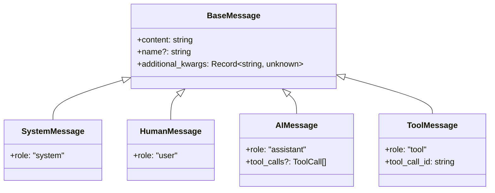
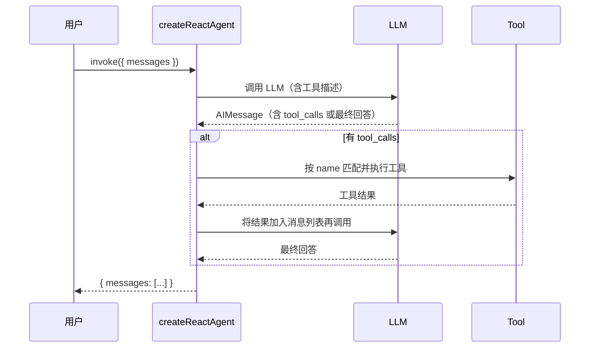
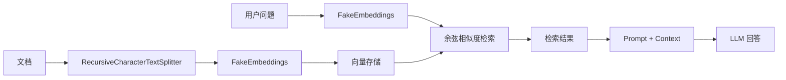
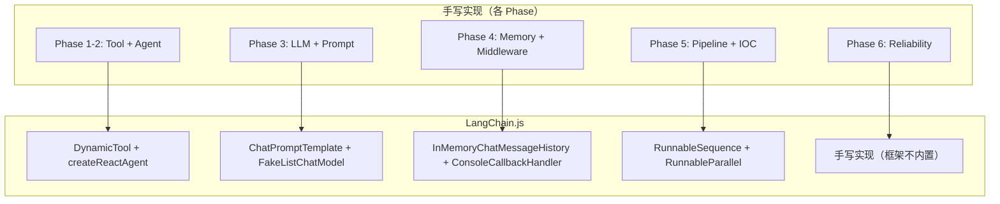
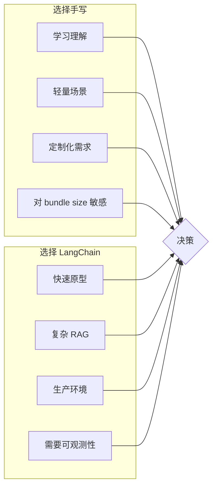

# 第 7 章：LangChain.js 深度实战

> 从前六章我们手写了 Agent 的每一个齿轮——Tool 定义、状态管理、多 Agent 编排。现在，是时候把这些经验映射到工业级框架 LangChain.js 上了。

> 本章所有代码示例使用 `FakeListChatModel` 和 `FakeEmbeddings`，**无需 API Key 即可运行**。

## 🎯 学习目标

| 目标 | 掌握程度 |
|------|---------|
| 理解 LangChain.js 生态与核心模块 | 能说出每个 @langchain/* 包的职责 |
| 掌握 ChatModel 与 Message 体系 | 熟练使用 SystemMessage / HumanMessage / AIMessage / ToolMessage |
| 学会 PromptTemplate 与 ChatPromptTemplate | 能用 MessagesPlaceholder 构建动态模板 |
| 编写 DynamicTool | 能用 DynamicTool 定义字符串输入/输出的 Tool |
| 搭建 Agent | 用 createReactAgent 创建可运行的 ReAct Agent |
| 集成 Memory | 使用 InMemoryChatMessageHistory + ConversationMemory 封装 |
| 实现 RAG 链路 | 文档分割 → Embedding → 相似度检索 → QA chain |
| 理解 LCEL | 用 pipe 操作符组合 Chain |
| 实现 Callbacks | 用 ConsoleCallbackHandler 实现可观测性 |
| 手写 vs LangChain 对照 | 将前六章每个概念映射到 LangChain 等价物 |

## 📖 7.1 LangChain.js 生态全景

LangChain.js 不是单个库，而是一组按职责拆分的 npm 包。下图展示了核心模块与依赖关系：

```mermaid
graph TB
    subgraph "应用层"
        A[你的 Agent / Chain]
    end

    subgraph "编排层"
        B[@langchain/core]
        C[@langchain/langgraph]
    end

    subgraph "模型与工具"
        D[@langchain/anthropic]
        E[@langchain/openai]
        F[@langchain/community]
        G[@langchain/ollama]
    end

    subgraph "向量存储"
        H[@langchain/pinecone]
        I[@langchain/chroma]
        J[@langchain/redis]
        K[@langchain/mongodb]
    end

    subgraph "文档加载"
        L[@langchain/document-loaders]
        M[unstructured.io]
    end

    A --> B
    A --> C
    B --> D & E & F & G
    B --> H & I & J & K
    B --> L & M
    
    style B fill:#4A90D9,color:#fff
    style C fill:#7B61FF,color:#fff
```

### 7.1.1 LangGraph 与 createReactAgent

实际代码使用基于 LangGraph 的 `createReactAgent`（ReAct 范式），而非旧版 `createToolCallingAgent` + `AgentExecutor`。

| 维度 | LangChain 旧 API | 本教程使用的 API |
|------|---------------|-----------------|
| 核心函数 | `createToolCallingAgent` + `AgentExecutor` | `createReactAgent`（@langchain/langgraph/prebuilt） |
| Tool 定义 | `DynamicStructuredTool`（Zod Schema） | `DynamicTool`（字符串输入） |
| 模型指定 | `new ChatAnthropic({ model, apiKey })` | `FakeListChatModel`（无需 API Key） |
| 输入格式 | `{ input, chat_history, agent_scratchpad }` | `{ messages: [...] }` |
| 底层框架 | 独立 Agent Loop | LangGraph 图状态编排 |

### 7.1.2 核心包速查

| 包名 | 职责 | 前六章的对应概念 |
|------|------|-----------------|
| `@langchain/core` | 基类、Message 类型、Tool 基类、Callback 接口 | `Tool` 基类、`AgentMessage` |
| `@langchain/core/utils/testing` | FakeListChatModel、FakeEmbeddings | 测试用 Mock 模型 |
| `@langchain/core/tracers/console` | ConsoleCallbackHandler | 控制台日志追踪 |
| `@langchain/core/chat_history` | InMemoryChatMessageHistory | `ConversationManager` |
| `@langchain/textsplitters` | RecursiveCharacterTextSplitter | 文档分割 |
| `@langchain/langgraph/prebuilt` | createReactAgent | `AgentRuntime` 多 Agent 编排 |
| `@langchain/community` | 社区集成（搜索、API） | 自定义 Tool 的外部 API 调用 |

### 7.1.3 安装

```bash
npm install @langchain/core @langchain/community @langchain/textsplitters
npm install @langchain/langgraph
```

---

## 📖 7.2 ChatModel 与 Message 体系

前六章我们手写了 `AgentMessage` 类型和 `createAnthropicClient`。LangChain 提供了完整的 Message 类型体系。

### 7.2.1 Message 类型



### 7.2.2 基础调用

```typescript
import { FakeListChatModel } from "@langchain/core/utils/testing";
import { SystemMessage, HumanMessage, AIMessage } from "@langchain/core/messages";

const model = new FakeListChatModel({
  responses: ["React 用虚拟 DOM，Vue 用模板编译。"],
});

// 单轮对话
const response = await model.invoke([
  new SystemMessage("你是一个专业的前端架构师。"),
  new HumanMessage("React 和 Vue 的主要区别是什么？"),
]);
// AIMessage { content: "React 用虚拟 DOM，Vue 用模板编译。" }
console.log(response.content);
```

### 7.2.3 多轮对话

```typescript
const messages = [
  new SystemMessage("你是一个 Git 专家。"),
  new HumanMessage("怎么撤销最近一次 commit？"),
  new AIMessage("使用 `git reset --soft HEAD~1`。"),
  new HumanMessage("那如果想保留改动呢？"),
];

const response = await model.invoke(messages);
```

### 7.2.4 Streaming（流式输出）

```typescript
import { AIMessageChunk } from "@langchain/core/messages";

const stream = await model.stream([
  new SystemMessage("用中文解释 Event Loop。"),
  new HumanMessage("开始"),
]);

for await (const chunk of stream) {
  // chunk 是 AIMessageChunk 实例
  process.stdout.write(chunk.content as string);
}
```

### 7.2.5 Batch（批量调用）

```typescript
const results = await model.batch([
  [new HumanMessage("1+1=?")],
  [new HumanMessage("2+2=?")],
  [new HumanMessage("3+3=?")],
]);
// results: [AIMessage, AIMessage, AIMessage]
```

### 7.2.6 手写 vs LangChain 对照

| 手写实现（第 2 章） | LangChain 等价物 |
|---------------------|-----------------|
| `AgentMessage` 联合类型 | `BaseMessage` + 子类 |
| `createAnthropicClient(apiKey)` | `FakeListChatModel`（测试用）/ `ChatAnthropic`（生产） |
| `system`, `user`, `assistant` role 字符串 | `SystemMessage`, `HumanMessage`, `AIMessage` |
| `role: "tool"` + `tool_call_id` | `ToolMessage` |
| 手动拼接流式 chunk | `model.stream()` + `for await` |
| `Promise.all` 并发调用 | `model.batch()` |

---

## 📖 7.3 PromptTemplate 与 ChatPromptTemplate

前六章我们用手动字符串拼接构建 prompt。LangChain 提供模板引擎。

### 7.3.1 PromptTemplate（纯文本模板）

```typescript
import { PromptTemplate } from "@langchain/core/prompts";

const template = PromptTemplate.fromTemplate(
  `你是一个{topic}专家。请回答以下问题：{question}`
);

const formatted = await template.format({
  topic: "TypeScript",
  question: "什么是泛型约束？",
});
// "你是一个TypeScript专家。请回答以下问题：什么是泛型约束？"
```

### 7.3.2 ChatPromptTemplate（对话模板）

```typescript
import {
  ChatPromptTemplate,
  SystemMessagePromptTemplate,
  HumanMessagePromptTemplate,
} from "@langchain/core/prompts";

const chatTemplate = ChatPromptTemplate.fromMessages([
  SystemMessagePromptTemplate.fromTemplate(
    "你是一个{topic}专家。请用{language}回答。"
  ),
  HumanMessagePromptTemplate.fromTemplate("{question}"),
]);

const messages = await chatTemplate.formatMessages({
  topic: "React",
  language: "中文",
  question: "什么是 useState？",
});
// [SystemMessage, HumanMessage]
```

### 7.3.3 MessagesPlaceholder（动态消息占位符）

`MessagesPlaceholder` 允许在运行时动态插入任意数量的消息（如历史记录）：

```typescript
import { MessagesPlaceholder } from "@langchain/core/prompts";

const agentPrompt = ChatPromptTemplate.fromMessages([
  ["system", "你是一个智能助手。"],
  new MessagesPlaceholder("chat_history"),
  ["human", "{input}"],
]);

// 渲染时，chat_history 会展开为多条 Message
```

> 注意：本章使用 `createReactAgent`（基于 LangGraph），它内部自动管理消息列表，无需手动使用 `MessagesPlaceholder`。上述模式适用于旧版 `createToolCallingAgent` + `AgentExecutor` API。

### 7.3.4 手写 vs LangChain 对照

| 手写实现（第 2-3 章） | LangChain 等价物 |
|----------------------|-----------------|
| `constructSystemPrompt(tools)` | `SystemMessagePromptTemplate` + tools 变量 |
| 字符串模板 + 手动替换 | `PromptTemplate.format()` |
| 手动构建 Message 数组 | `ChatPromptTemplate.fromMessages()` |
| 在 prompt 中插入历史消息 | `MessagesPlaceholder("chat_history")` |
| 在 prompt 中插入思考步骤 | `MessagesPlaceholder("agent_scratchpad")` |

---

## 📖 7.4 DynamicTool 工具定义

前六章我们手写了 `Tool` 基类和 Schema 验证。本章使用 `DynamicTool`——最简单的 Tool 类，输入输出都为字符串。

### 7.4.1 定义工具

```typescript
import { DynamicTool } from "@langchain/core/tools";

const calculator = new DynamicTool({
  name: "calculator",
  description: "计算两个数字的乘积，输入格式: a,b",
  func: async (input: string) => {
    const [a, b] = input.split(",").map(Number);
    return String(a * b);
  },
});

const search = new DynamicTool({
  name: "search",
  description: "搜索知识库获取信息",
  func: async (query: string) => {
    return `关于 "${query}" 的搜索结果：LangChain 是一个用于构建 LLM 应用的框架。`;
  },
});
```

`DynamicTool` 的 `func` 接收纯字符串输入，返回纯字符串。不需要 Zod Schema，适合快速原型和简单工具。

> 如果需要类型安全的结构化输入，LangChain 也提供 `DynamicStructuredTool` + Zod Schema，但本章实际代码统一使用 `DynamicTool`。

### 7.4.2 绑定工具到模型

当使用 `createReactAgent` 创建 Agent 时，工具会自动绑定到模型，无需手动调用 `bindTools`。

### 7.4.3 手写 vs LangChain 对照

| 手写实现（第 1-2 章） | LangChain 等价物 |
|----------------------|-----------------|
| `class Tool { schema, execute }` | `DynamicTool` / `DynamicStructuredTool` |
| Zod 手动校验 `schema.parse()` | `DynamicStructuredTool` 自动集成 |
| 手动解析 `tool_use` block | Agent 框架自动处理 |
| 手动匹配 tool name 并调用 | Agent 框架自动处理 |

---

## 📖 7.5 createReactAgent — 基于 LangGraph 的 Agent

前六章我们手写了 `AgentRuntime.execute()` 循环。本章使用 `createReactAgent`——基于 LangGraph 的 ReAct Agent，通过 `@langchain/langgraph/prebuilt` 引入。

### 7.5.1 完整 Agent 搭建

```typescript
import { createReactAgent } from "@langchain/langgraph/prebuilt";
import { DynamicTool } from "@langchain/core/tools";
import { HumanMessage } from "@langchain/core/messages";
import { FakeListChatModel } from "@langchain/core/utils/testing";

// 1. 模拟 LLM（无需 API Key）
const model = new FakeListChatModel({
  responses: [
    `{"action": "calculator", "action_input": "3,4"}`,
    `{"action": "search", "action_input": "LangChain agents"}`,
    "最终答案: 3 * 4 = 12，LangChain 提供了强大的 Agent 支持。",
  ],
});

// 2. 定义工具（DynamicTool，字符串输入）
const tools = [
  new DynamicTool({
    name: "calculator",
    description: "计算两个数字的乘积，输入格式: a,b",
    func: async (input: string) => {
      const [a, b] = input.split(",").map(Number);
      return String(a * b);
    },
  }),
  new DynamicTool({
    name: "search",
    description: "搜索知识库获取信息",
    func: async (query: string) => {
      return `关于 "${query}" 的搜索结果：LangChain 是一个用于构建 LLM 应用的框架。`;
    },
  }),
];

// 3. 创建 Agent
const agent = await createReactAgent({ llm: model, tools });

// 4. 执行
const result = await agent.invoke({
  messages: [new HumanMessage("计算 3 * 4 并搜索 LangChain 相关资料")],
});

const lastMsg = result.messages[result.messages.length - 1];
console.log(lastMsg.content);
// 输出: 最终答案: 3 * 4 = 12，LangChain 提供了强大的 Agent 支持。
```

### 7.5.2 createReactAgent 的执行流程



> `createReactAgent` 内部使用 LangGraph 的状态图管理 ReAct 循环。与旧版 `AgentExecutor` 的区别在于：它直接使用 Messages 格式（`{ messages: [...] }`），无需 `agent_scratchpad` 占位符，并且天然支持持久化和中断恢复。

### 7.5.3 封装工厂函数

实际项目中可以将 Agent 创建封装为工厂函数：

```typescript
export async function createAgent(llm?: BaseChatModel) {
  const model = llm ?? new FakeListChatModel({
    responses: [
      `{"action": "calculator", "action_input": "3,4"}`,
      `{"action": "search", "action_input": "LangChain agents"}`,
      "最终答案: 3 * 4 = 12，LangChain 提供了强大的 Agent 支持。",
    ],
  });

  const tools = [
    new DynamicTool({
      name: "calculator",
      description: "计算两个数字的乘积，输入格式: a,b",
      func: async (input: string) => {
        const [a, b] = input.split(",").map(Number);
        return String(a * b);
      },
    }),
    new DynamicTool({
      name: "search",
      description: "搜索知识库获取信息",
      func: async (query: string) => {
        return `关于 "${query}" 的搜索结果：LangChain 是一个用于构建 LLM 应用的框架。`;
      },
    }),
  ];

  const agent = await createReactAgent({ llm: model, tools });
  return { agent, tools };
}

export async function runAgent(agent: ReturnType<typeof createReactAgent>, input: string) {
  const result = await agent.invoke({ messages: [new HumanMessage(input)] });
  const lastMsg = result.messages[result.messages.length - 1];
  return typeof lastMsg.content === "string" ? lastMsg.content : JSON.stringify(lastMsg.content);
}
```

### 7.5.4 手写 vs LangChain 对照

| 手写实现（第 2-5 章） | LangChain 等价物 |
|----------------------|-----------------|
| `AgentRuntime.execute()` | `createReactAgent().invoke()` |
| `maxIterations` 检查 | LangGraph 内置循环控制 |
| 手动构建思考→工具→思考循环 | LangGraph 状态图自动处理 |
| `tool_call_id` 追踪 | 框架自动维护 |
| 手动处理 prompt 中的工具描述 | 框架自动注入工具描述 |

---

## 📖 7.6 Memory 集成

前六章我们手写了 `ConversationManager` 和消息历史管理。本章使用 `InMemoryChatMessageHistory` 作为存储后端，封装为 `ConversationMemory` 类，通过格式化上下文注入 prompt 实现带记忆的对话链。

### 7.6.1 InMemoryChatMessageHistory

`InMemoryChatMessageHistory` 是 LangChain 提供的内存级消息历史存储，支持增、查、清三种操作：

```typescript
import { InMemoryChatMessageHistory } from "@langchain/core/chat_history";
import { HumanMessage, AIMessage } from "@langchain/core/messages";

const history = new InMemoryChatMessageHistory();
await history.addMessage(new HumanMessage("你好"));
await history.addMessage(new AIMessage("你好！我是 AI 助手。"));

const messages = await history.getMessages();
console.log(messages.length); // 2

await history.clear();
```

### 7.6.2 ConversationMemory 封装

实际代码中将 `InMemoryChatMessageHistory` 封装为 `ConversationMemory` 类，增加便捷方法：

```typescript
import { InMemoryChatMessageHistory } from "@langchain/core/chat_history";
import { BaseMessage, HumanMessage, AIMessage } from "@langchain/core/messages";

export class ConversationMemory {
  private history: InMemoryChatMessageHistory;

  constructor() {
    this.history = new InMemoryChatMessageHistory();
  }

  async addMessage(msg: BaseMessage): Promise<void> {
    await this.history.addMessage(msg);
  }

  async getMessages(): Promise<BaseMessage[]> {
    return this.history.getMessages();
  }

  async clear(): Promise<void> {
    await this.history.clear();
  }

  async getMessageCount(): Promise<number> {
    const msgs = await this.history.getMessages();
    return msgs.length;
  }

  async formatContext(): Promise<string> {
    const msgs = await this.history.getMessages();
    return msgs.map((m) => `${m._getType()}: ${m.content}`).join("\n");
  }
}
```

### 7.6.3 带记忆的对话链

将 Memory 与 LCEL 链结合：

```typescript
import { FakeListChatModel } from "@langchain/core/utils/testing";
import { ChatPromptTemplate } from "@langchain/core/prompts";

const model = new FakeListChatModel({
  responses: ["你好！我是 AI 助手。", "Agent 是基于 LLM 的自主程序。", "记忆功能让我能记住之前的对话。"],
});

const prompt = ChatPromptTemplate.fromMessages([
  ["system", "你是一个 AI 助手。对话历史：\n{history}"],
  ["human", "{input}"],
]);

const chain = prompt.pipe(model);
const memory = new ConversationMemory();

// 多轮对话
for (const msg of ["你好", "什么是 Agent？", "你能记住之前的对话吗？"]) {
  await memory.addMessage(new HumanMessage(msg));
  const history = await memory.formatContext();
  const result = await chain.invoke({ input: msg, history });
  const response = typeof result.content === "string" ? result.content : JSON.stringify(result.content);
  await memory.addMessage(new AIMessage(response));

  console.log(`用户: ${msg}`);
  console.log(`AI: ${response}`);
}

console.log(`总消息数: ${await memory.getMessageCount()}`);
```

每次对话将用户输入和 AI 响应都存入 `ConversationMemory`，下次调用时 `formatContext()` 将历史转换为字符串注入 prompt，实现多轮记忆。

### 7.6.4 手写 vs LangChain 对照

| 手写实现（第 4 章） | LangChain 等价物 |
|---------------------|-----------------|
| `ConversationManager` | `InMemoryChatMessageHistory` |
| `addMessage/getHistory` | `InMemoryChatMessageHistory.addMessage()/getMessages()` |
| 手动拼接历史到 Prompt | `ConversationMemory.formatContext()` |
| 多 session 隔离 | 多个 `ConversationMemory` 实例 |

---

## 📖 7.7 RAG 入门

Retrieval-Augmented Generation（检索增强生成）让 LLM 能访问外部知识库。本章实现了一个手写的 RAG Pipeline，使用 `FakeEmbeddings` 和余弦相似度搜索，无需外部 API。



### 7.7.1 文档分割

```typescript
import { RecursiveCharacterTextSplitter } from "@langchain/textsplitters";

const splitter = new RecursiveCharacterTextSplitter({
  chunkSize: 60,
  chunkOverlap: 10,
});

const documents = await splitter.createDocuments([
  "Agent 是能自主决策和行动的程序，通过感知、规划、执行完成任务。",
  "ReAct 模式结合推理和行动，让 Agent 边思考边执行。",
]);
```

### 7.7.2 Embedding 与向量检索

实际代码手写了一个 `RAGPipeline` 类，使用 `FakeEmbeddings` 和余弦相似度：

```typescript
import { FakeEmbeddings } from "@langchain/core/utils/testing";
import { Document } from "@langchain/core/documents";

class RAGPipeline {
  private splitter = new RecursiveCharacterTextSplitter({ chunkSize: 60, chunkOverlap: 10 });
  private embeddings = new FakeEmbeddings();
  private docs: Document[] = [];
  private vectors: number[][] = [];

  // 索引文档：分割 + Embedding
  async index(texts: string[], source?: string): Promise<void> {
    const documents = await this.splitter.createDocuments(texts.map((t) => t));
    for (const doc of documents) {
      doc.metadata = { source: source ?? "unknown" };
      this.docs.push(doc);
      const vec = await this.embeddings.embedQuery(doc.pageContent);
      this.vectors.push(vec);
    }
  }

  // 检索：余弦相似度
  async search(query: string, k = 2): Promise<Document[]> {
    const queryVec = await this.embeddings.embedQuery(query);
    const scored = this.docs
      .map((doc, i) => ({ doc, score: this.cosineSimilarity(queryVec, this.vectors[i]) }))
      .sort((a, b) => b.score - a.score);
    return scored.slice(0, k).map((e) => e.doc);
  }

  private cosineSimilarity(a: number[], b: number[]): number {
    let dot = 0, na = 0, nb = 0;
    for (let i = 0; i < a.length; i++) {
      dot += a[i] * b[i];
      na += a[i] * a[i];
      nb += b[i] * b[i];
    }
    const mag = Math.sqrt(na) * Math.sqrt(nb);
    return mag === 0 ? 0 : dot / mag;
  }
}
```

### 7.7.3 QA Chain

将检索到的上下文注入 Prompt，调用 LLM 生成回答：

```typescript
async query(question: string): Promise<{ answer: string; sources: string[] }> {
  const relevantDocs = await this.search(question, 2);
  const context = relevantDocs.map((d) => d.pageContent).join("\n\n");

  const model = new FakeListChatModel({
    responses: [`基于检索结果：${context.slice(0, 50)}...`],
  });

  const prompt = ChatPromptTemplate.fromMessages([
    ["system", "基于以下上下文回答问题：\n{context}"],
    ["human", "{question}"],
  ]);

  const chain = prompt.pipe(model);
  const result = await chain.invoke({ context, question });

  return {
    answer: typeof result.content === "string" ? result.content : JSON.stringify(result.content),
    sources: relevantDocs.map((d) => String(d.metadata.source ?? "unknown")),
  };
}
```

### 7.7.4 完整使用

```typescript
const rag = new RAGPipeline();

await rag.index([
  "Agent 是能自主决策和行动的程序，通过感知、规划、执行完成任务。",
  "ReAct 模式结合推理和行动，让 Agent 边思考边执行。",
  "Tool Calling 让 Agent 能调用搜索、计算等外部工具。",
  "LangChain.js 是构建 LLM 应用的 TypeScript 框架。",
  "RAG 通过检索文档增强 LLM 生成质量，减少幻觉。",
], "agent-docs.md");

console.log(`已索引 ${rag.documentCount} 个文档块`);

for (const q of ["什么是 Agent？", "什么是 RAG？"]) {
  const result = await rag.query(q);
  console.log(`问题: ${q}`);
  console.log(`回答: ${result.answer}`);
  console.log(`来源: ${result.sources.join(", ")}`);
}
```

### 7.7.5 手写 vs LangChain 对照

| 手写概念 | LangChain 等价物 |
|---------|-----------------|
| 文档分块逻辑 | `RecursiveCharacterTextSplitter` |
| Embedding 向量化 | `FakeEmbeddings`（测试）/ `OpenAIEmbeddings`（生产） |
| 向量存储实现 | 手写数组 + 余弦相似度（或 `MemoryVectorStore`） |
| 相似度检索 | `cosineSimilarity()` 手写实现 |
| Prompt 拼接上下文 | `ChatPromptTemplate` + 变量注入 |
| 完整 RAG 链路 | `RAGPipeline` 类封装 |

---

## 📖 7.8 LCEL（LangChain Expression Language）

LCEL 是 LangChain 的核心范式——用 `pipe` 操作符组合组件。对应前六章的 `IOCContainer` 和 `pipeline` 模式。

### 7.8.1 基础 Pipe

```typescript
import { RunnableSequence } from "@langchain/core/runnables";
import { StringOutputParser } from "@langchain/core/output_parsers";
import { ChatPromptTemplate } from "@langchain/core/prompts";
import { FakeListChatModel } from "@langchain/core/utils/testing";

const prompt = ChatPromptTemplate.fromMessages([
  ["system", "你是一个翻译助手。将以下文本翻译成中文。"],
  ["human", "{input}"],
]);

const model = new FakeListChatModel({
  responses: ["翻译结果：你好，世界！"],
});

// 简单 chain: Prompt → Model → OutputParser
const chain = prompt.pipe(model).pipe(new StringOutputParser());

const result = await chain.invoke({ input: "Hello World" });
console.log(result);  // "翻译结果：你好，世界！"
```

### 7.8.2 RunnablePassthrough（透传）

`RunnablePassthrough` 保留原始输入不变，同时允许在并行 pipeline 中传递数据：

```typescript
import { RunnableSequence, RunnablePassthrough } from "@langchain/core/runnables";

const chain = RunnableSequence.from([
  {
    original: new RunnablePassthrough(),
    processed: (input: string) => `处理: ${input}`,
  },
  model,
  new StringOutputParser(),
]);

const result = await chain.invoke("Hello");
// processed 分支处理输入，original 分支透传原始值
```

### 7.8.3 RunnableParallel（并行执行）

`RunnableParallel` 同时执行多个独立链并将结果合并：

```typescript
import { RunnableParallel } from "@langchain/core/runnables";

const summaryPrompt = ChatPromptTemplate.fromMessages([
  ["human", "总结: {text}"],
]);
const keywordPrompt = ChatPromptTemplate.fromMessages([
  ["human", "提取关键词: {text}"],
]);

const model = new FakeListChatModel({
  responses: ["摘要: Agent 是自主程序", "关键词: Agent, LLM, 工具"],
});

const parallel = RunnableParallel.from({
  summary: summaryPrompt.pipe(model).pipe(new StringOutputParser()),
  keywords: keywordPrompt.pipe(model).pipe(new StringOutputParser()),
});

const result = await parallel.invoke({ text: "Agent 是基于 LLM 的自主程序" });
// { summary: "摘要: Agent 是自主程序", keywords: "关键词: Agent, LLM, 工具" }
```

### 7.8.4 手写 vs LangChain 对照

| 手写实现（第 5 章） | LangChain 等价物 |
|---------------------|-----------------|
| `pipeline(result => step1.then(step2))` | `RunnableSequence.from([...])` |
| `IOCContainer.getService()` | `RunnableParallel` |
| 手动条件分支 `if/else` | JS 原生 `if/else` 或 `RunnableBranch` |
| `logMiddleware` 日志 | `RunnablePassthrough` + Callbacks |
| 自定义 `transform` 函数 | `.pipe()` 操作符 |

---

## 📖 7.9 Callbacks 与可观测性

前六章的 `logMiddleware` 提供了基础日志。LangChain 的 Callbacks 系统提供完整的可观测性。本章使用 `ConsoleCallbackHandler`——一个内置的回调处理器，自动将 LLM 调用、链执行等信息输出到控制台。

### 7.9.1 ConsoleCallbackHandler

```typescript
import { ConsoleCallbackHandler } from "@langchain/core/tracers/console";
import { FakeListChatModel } from "@langchain/core/utils/testing";
import { HumanMessage } from "@langchain/core/messages";

const model = new FakeListChatModel({ responses: ["这是带回调的响应。"] });
const consoleHandler = new ConsoleCallbackHandler();

const result = await model.invoke(
  [new HumanMessage("测试回调")],
  { callbacks: [consoleHandler] },
);
```

执行时，控制台会自动输出 LLM 调用的开始、结束、耗时等调试信息，无需手动实现日志逻辑。

### 7.9.2 自定义 CallbackHandler

如果需要更精细的控制，可以继承 `BaseCallbackHandler` 自定义处理逻辑：

```typescript
import { BaseCallbackHandler } from "@langchain/core/callbacks/base";

class MyLogHandler extends BaseCallbackHandler {
  name = "MyLogHandler";

  async handleLLMStart(llm: any, prompts: string[]) {
    console.log(`[LLM 开始]`, prompts[0]?.slice(0, 50));
  }

  async handleLLMEnd(output: any) {
    console.log(`[LLM 结束]`);
  }

  async handleLLMError(err: any) {
    console.error(`[LLM 错误]`, err);
  }

  async handleToolStart(tool: any, input: string) {
    console.log(`[工具调用] ${tool.name}`, input);
  }

  async handleToolEnd(output: string) {
    console.log(`[工具结果]`, output.slice(0, 100));
  }
}
```

### 7.9.3 使用 Callbacks

```typescript
// 单次调用 Callback
await model.invoke([new HumanMessage("Hello")], {
  callbacks: [new MyLogHandler()],
});

// Agent 级别 Callback
const { agent } = await createAgent();
const result = await agent.invoke(
  { messages: [new HumanMessage("计算 3 * 4")] },
  { callbacks: [new MyLogHandler()] },
);
```

### 7.9.4 手写 vs LangChain 对照

| 手写实现（第 4 章） | LangChain 等价物 |
|---------------------|-----------------|
| `logMiddleware` | `ConsoleCallbackHandler` / `BaseCallbackHandler` |
| 日志级别控制 | `verbose: true` |
| Token 手动计数 | `llmOutput?.tokenUsage` |
| 自定义日志格式 | 重写 `handleLLMStart` 等方法 |

---

## 🛠️ 7.10 完整实战：组合所有模式

实际项目可以将 Agent、Memory、RAG、LCEL、Callbacks 组合使用。Phase 7 的 `src/index.ts` 入口文件演示了所有五大模式的串联运行：

```typescript
async function main() {
  // 1. Agent — createReactAgent + DynamicTool
  const { agent, tools } = await createAgent();
  const result = await runAgent(agent, "计算 3 * 4 并搜索 LangChain 相关资料");

  // 2. Memory — InMemoryChatMessageHistory + ConversationMemory
  const memory = new ConversationMemory();
  const chain = createMemoryChain();
  for (const msg of ["你好", "什么是 Agent？"]) {
    await memory.addMessage(new HumanMessage(msg));
    const response = await chain.call(msg, await memory.formatContext());
    await memory.addMessage(new AIMessage(response));
  }

  // 3. RAG — RecursiveCharacterTextSplitter + FakeEmbeddings + 余弦相似度
  const rag = new RAGPipeline();
  await rag.index(["Agent 是能自主决策和行动的程序。"], "agent-docs.md");
  const ragResult = await rag.query("什么是 Agent？");

  // 4. LCEL — RunnableSequence / RunnableParallel / RunnablePassthrough
  const basic = LCELDemo.createBasicChain();
  const parallel = LCELDemo.createParallelChain();

  // 5. Callbacks — ConsoleCallbackHandler
  await runWithCallbacks();
}
```

对比各模式的复杂度：

| 模式 | 核心类/函数 | 代码量 | 需要 API Key |
|------|------------|--------|-------------|
| Agent | `createReactAgent` + `DynamicTool` | ~50 行 | ❌（FakeListChatModel） |
| Memory | `InMemoryChatMessageHistory` + `ConversationMemory` | ~40 行 | ❌ |
| RAG | `RAGPipeline`（手写检索） | ~90 行 | ❌（FakeEmbeddings） |
| LCEL | `RunnableSequence` / `RunnableParallel` | ~30 行 | ❌ |
| Callbacks | `ConsoleCallbackHandler` | ~10 行 | ❌ |

---

## 📊 7.11 手写实现 vs LangChain 对照总表

这是全书最关键的章节——将各章手写概念映射到 LangChain.js 等价物。

### Phase 1-2：Tool System + Agent 基础

| 手写概念 | Phase | LangChain 等价物 |
|---------|-------|-----------------|
| `Tool` 基类 | phase-1/2 | `DynamicTool` / `DynamicStructuredTool` |
| `ToolSchema` + Zod 校验 | phase-1/2 | `DynamicStructuredTool` 自动集成 |
| 工具注册到 Registry | phase-2 | `createReactAgent({ tools })` 数组 |
| `AgentRuntime.execute()` 循环 | phase-2 | `createReactAgent`（LangGraph 状态图） |
| `AgentMessage` 联合类型 | phase-2 | `BaseMessage` + 子类 |
| `maxIterations` 循环控制 | phase-2 | LangGraph 内置 |

### Phase 3：LLM 调用 + Prompt

| 手写概念 | Phase | LangChain 等价物 |
|---------|-------|-----------------|
| `createAnthropicClient(apiKey)` | phase-3 | `ChatAnthropic` / `FakeListChatModel` |
| 手动构建 System/User 消息 | phase-3 | `SystemMessage` / `HumanMessage` / `AIMessage` |
| 字符串模板 + 手动替换 | phase-3 | `ChatPromptTemplate.fromMessages()` |
| 在 prompt 中插入历史消息 | phase-3 | `MessagesPlaceholder("chat_history")` |
| tool_use block 手动解析 | phase-3 | Agent 框架自动处理 |

### Phase 4：Middleware + Memory

| 手写概念 | Phase | LangChain 等价物 |
|---------|-------|-----------------|
| `ConversationManager` | phase-4 | `InMemoryChatMessageHistory` |
| `addMessage/getHistory` | phase-4 | `InMemoryChatMessageHistory.addMessage()/getMessages()` |
| 手动拼接历史到 Prompt | phase-4 | `ConversationMemory.formatContext()` |
| `logMiddleware` 日志中间件 | phase-4 | `ConsoleCallbackHandler` / `BaseCallbackHandler` |
| Token 用量追踪 | phase-4 | `llmOutput?.tokenUsage` |

### Phase 5：Pipeline + IOC

| 手写概念 | Phase | LangChain 等价物 |
|---------|-------|-----------------|
| `pipeline(result => step1.then(step2))` | phase-5 | `RunnableSequence.from([...])` / `.pipe()` |
| `IOCContainer.getService()` | phase-5 | `RunnableParallel` |
| 手动条件分支 `if/else` | phase-5 | JS 原生 `if/else` 或 `RunnableBranch` |
| 自定义 `transform` 函数 | phase-5 | `.pipe()` 操作符 |

### Phase 6：Reliability

| 手写概念 | Phase | LangChain 等价物 |
|---------|-------|-----------------|
| `CircuitBreaker` | phase-6 | 需要手写（可在 Callback 中实现） |
| `RateLimiter` | phase-6 | 需要手写 |
| `CostGuard` | phase-6 | `llmOutput?.tokenUsage` 手动计算 |
| `Idempotency` | phase-6 | 需要手写 |
| `Permission` | phase-6 | `@langchain/community` 插件 |

### 综合对照



---

## ✅ 自检清单

- [ ] 能说出 `@langchain/core`、`@langchain/core/utils/testing`、`@langchain/community` 的区别
- [ ] 能区分 `SystemMessage`、`HumanMessage`、`AIMessage`、`ToolMessage` 的用途
- [ ] 知道 `MessagesPlaceholder` 的作用场景
- [ ] 能独立编写 `DynamicTool`（字符串输入）
- [ ] 能用 `createReactAgent` + `DynamicTool` 搭建 Agent
- [ ] 理解 `createReactAgent` 使用 Messages 格式而非 agent_scratchpad 格式
- [ ] 能用 `InMemoryChatMessageHistory` 管理对话历史
- [ ] 能实现完整的 RAG 链路：分割 → Embedding → 相似度检索 → QA
- [ ] 能用 `pipe` 操作符组合 LCEL Chain
- [ ] 会用 `ConsoleCallbackHandler` 实现控制台日志
- [ ] 能对照说出各章每个概念在 LangChain 中的等价物

---

## 📚 延伸阅读

- [LangChain.js 官方文档](https://js.langchain.com/)
- [LangChain.js Quickstart](https://js.langchain.com/docs/tutorials/llm_chain/)
- [LangChain.js 概念指南](https://js.langchain.com/docs/concepts/)
- [LangSmith 可观测性平台](https://smith.langchain.com/)
- [Microsoft: LangChain.js for Beginners 课程](https://github.com/microsoft/langchainjs-beginners)
- [LangChain 官方示例库](https://github.com/langchain-ai/langchainjs/tree/main/examples)
- [LangGraph.js 文档](https://langchain-ai.github.io/langgraphjs/)
- [Zod 官方文档](https://zod.dev/)
- [OpenAI Embedding 模型](https://platform.openai.com/docs/guides/embeddings)

---

## 🎯 总结：从手写到框架

恭喜你完成了《Agent 开发入门教程》全部七章的学习！

### 我们学到了什么

**第 1 章：** Agent 是什么、Tool 系统的底层设计
**第 2 章：** 如何与 LLM 通信、Message 协议
**第 3 章：** Prompt 工程与 Tool Calling 循环
**第 4 章：** Middleware 架构与对话记忆
**第 5 章：** IOC 容器、Pipeline 与多 Agent 编排
**第 6 章：** MCP 协议、Service Registry 与跨进程通信
**第 7 章：** LangChain.js 框架映射与工业级实践

### 手写 vs 框架：何时选哪个



### 选择建议

| 场景 | 推荐方案 | 理由 |
|------|---------|------|
| 学习 Agent 原理 | 手写 | 理解每个齿轮的运作 |
| 快速 MVP/原型 | LangChain `createReactAgent` | 最快上手，最少代码 |
| 生产环境复杂 Agent | LangChain + LangGraph | 可观测性、错误处理、持久化内置 |
| 浏览器端 Agent | 手写 | LangChain.js 体积较大 |
| Vercel 生态项目 | Vercel AI SDK | 与 Next.js/Edge Runtime 深度集成 |
| 需要深度定制 | 手写 + 参考 LangChain 设计 | 吸取框架设计精华 |
| RAG 应用 | LangChain | 文档分割、VectorStore 集成完善 |
| 学习框架设计 | 手写后对照 LangChain | 理解为什么框架这样设计 |

### 从手写中学到的框架设计智慧

1. **插件化架构**：Tool 相当于 LangChain 的 `DynamicTool` / `DynamicStructuredTool`
2. **中间件模式**：对应 LangChain 的 `BaseCallbackHandler`
3. **Pipeline 组合**：对应 LCEL 的 `pipe` 操作符
4. **依赖注入**：对应 `RunnableParallel` 和 `RunnableSequence`
5. **消息协议标准化**：LangChain 用 `BaseMessage` 统一了所有消息类型
6. **关注点分离**：Prompt、Model、Tool、Memory 各司其职

### 下一站

- 深入学习 **LangGraph.js** 实现有状态多 Agent 编排
- 探索 **LangChain `createReactAgent`** 的持久化与中断恢复
- 学习 **LangSmith** 进行生产级追踪和评估
- 探索 **MCP (Model Context Protocol)** 作为标准工具协议
- 掌握 **Vercel AI SDK** — 它提供了 AGent 相关工具，是 LangChain.js 之外的另一主流选择
- 关注 [OpenAI Agents SDK](https://github.com/openai/openai-agents-python) 学习业界不同实现

---

> "手写让你理解本质，框架让你高效工作。两者结合，才是真正的 Agent 开发专家。"
>
> —— 全书完
