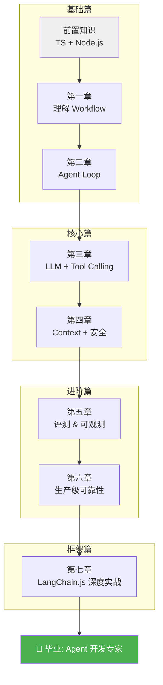

# Agent 开发学习路线图

> 从零到 Agent 开发专家，面向前端开发者的 TypeScript 学习路径。

---

## 全景路线图

---

## 各章节依赖关系

| 章节 | 前置依赖 | 核心新概念 |
|------|---------|-----------|
| 第一章：Workflow | 无 | Agent 生命周期、设计模式、I/O 契约 |
| 第二章：Agent Loop | 第一章 | ReAct 循环、意图分类、状态管理 |
| 第三章：LLM + Tool Calling | 第二章 | Provider 抽象、Tool Schema、沙箱 |
| 第四章：Context + 安全 | 第三章 | Context 组装、SQLite 记忆、Injection 防御 |
| 第五章：评测 | 第四~四章 | Eval Case、消融实验、Trajectory |
| 第六章：可靠性 | 全部前面 | 幂等、熔断、限流、成本、权限、日志 |
| 第七章：LangChain.js | 全部前面 | AgentExecutor、Memory、RAG、LCEL |

---

## 推荐学习节奏

| 时间 | 内容 | 产出 |
|------|------|------|
| 第 1 天 | 第一章 + 第二章 | 跑通第一个 Agent Loop |
| 第 2-3 天 | 第三章 + 第四章 | 接入 LLM + 加记忆 |
| 第 4 天 | 第五章 | 写 Eval Case + 跑评测 |
| 第 5 天 | 第六章 | 加可靠性组件 |
| 第 6-7 天 | 第七章 | 用 LangChain.js 重构 |

---

## 关键词速查

| 关键词 | 章节 | 一句话解释 |
|--------|------|-----------|
| Agent | 第一章 | 能自主推理、调用工具、执行多步任务的软件实体 |
| ReAct | 第二章 | Reason + Act，边推理边行动的循环范式 |
| Tool Calling | 第三章 | LLM 选择工具并生成参数，系统执行后回传结果 |
| Context | 第四章 | 拼给 LLM 的完整文本：System + History + Tools + Input |
| Prompt Injection | 第四章 | 恶意输入试图覆盖系统指令的安全攻击 |
| Eval Case | 第五章 | 评测 Agent 的原子用例（输入 + 期望行为） |
| 消融实验 | 第五章 | 开关功能组件，量化每个模块的贡献 |
| Circuit Breaker | 第六章 | 连续失败 N 次后熔断，防止故障蔓延 |
| Idempotency | 第六章 | 同一请求执行多次 = 执行一次的效果 |
| AgentExecutor | 第七章 | LangChain.js 的 Agent 循环引擎 |
| LCEL | 第七章 | LangChain Expression Language，用 `|` 组合 Chain |
| RAG | 第七章 | 检索增强生成：外部知识 + LLM 结合 |
